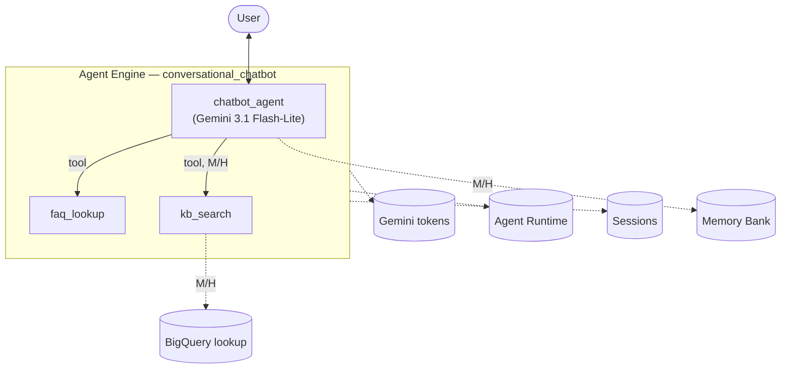
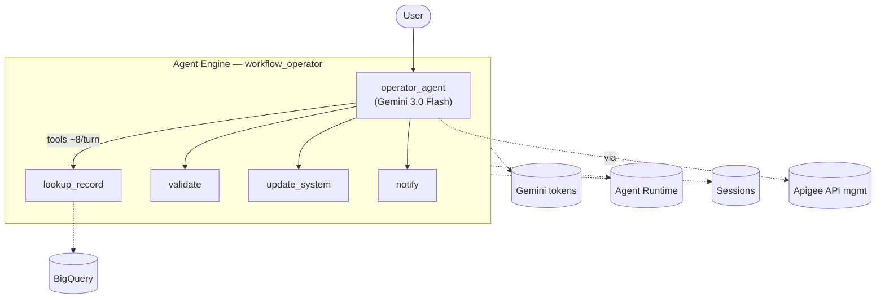
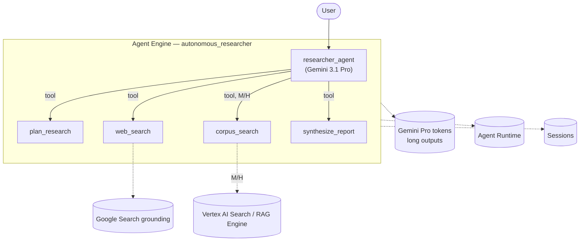
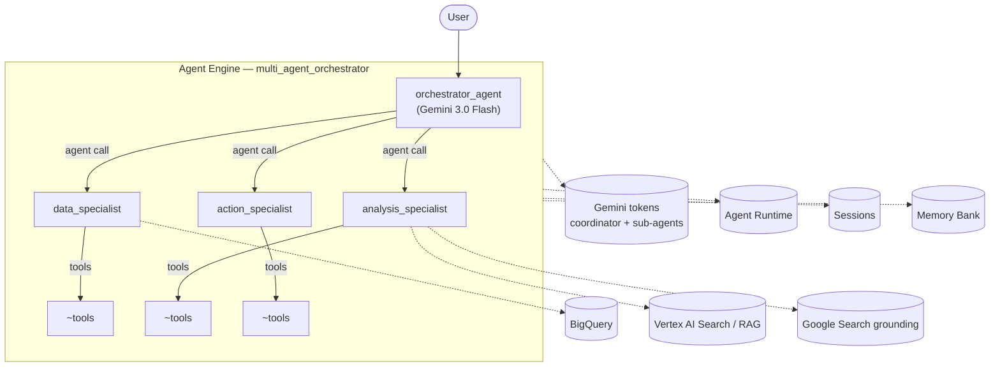

# Representative Agent Architectures — GE Agent Platform Archetypes

Design doc for **representative, deployable** agent architectures matching the four archetypes in
the calculator's Inputs tab (`Reference/AGENT_CALCULATOR_INPUTS.md`), each at Low / Moderate / High
complexity. Every architecture targets **Google Cloud / Gemini Enterprise Agent Platform (GEAP)**
built with **ADK** and deployed to **Vertex AI Agent Engine** (the managed Agent Runtime).

**Purpose:** give each calculator column a concrete agent we can actually deploy and measure, so the
placeholder input values can be replaced with **measured** per-SKU usage from real runs.

**Modeling note on Gemini version:** the calculator references Gemini 3.x tiers (Flash-Lite / Flash /
Pro). Our deployments use **`gemini-2.5-flash`** (proven deployable + already cost-characterized in
EXP-001…007). Model tier affects token *price*, not the *usage pattern* we measure; each design notes
its archetype's intended tier so prices can be re-derived from the Billing Catalog later.

---

## Archetype assumptions (from the calculator Inputs tab)

| Dimension | Conversational Chatbot | Workflow Operator | Autonomous Researcher | Multi-Agent Orchestrator |
|-----------|------------------------|-------------------|-----------------------|--------------------------|
| Queries/user/month | 100 | 100 | 20 | 40 |
| Turns/query (L/M/H) | 2 / 3 / 4 | 3 / 4 / 5 | 2 / 3 / 4 | 5 / 7 / 10 |
| % turns w/ tools (L/M/H) | – / 0.2 / 0.2 | 0.4 | 0.4 | 0.5 / 0.6 / 0.7 |
| Tools/turn | 3 | 8 | 8 | 25 / 35 / 45 |
| Agent calls | – | – | – | yes (orchestrator) |
| Intended Gemini model | 3.1 Flash-Lite | 3.0 Flash | 3.1 Pro (≤200k) | 3.0 Flash |
| Init / follow-up / output tokens | 300 / 150 / 400 | 500 / 250 / 750 | 2000 / 500 / 5000 | 300 / 150 / 400 |
| RAG / Search | optional | – | Search grounding | RAG + Search |
| Other SKUs | Memory Bank (M/H), BigQuery (M/H) | BigQuery, Apigee | Search, Vertex AI Search (RAG) | Sub-agents, BigQuery, RAG |

**The defining shape of each archetype:**
- **Conversational Chatbot** — single agent, short turns, light tool use, cheapest model. Cost driven by *volume* (100 q/user/mo), not depth.
- **Workflow Operator** — single agent that drives a deterministic multi-step process with heavy tool/API calls (8/turn). Cost driven by *tool fan-out*.
- **Autonomous Researcher** — single (or lightly-delegated) agent doing deep work: premium model, long outputs (5000 tok), Search grounding. Cost driven by *token depth*.
- **Multi-Agent Orchestrator** — coordinator delegating to many sub-agents, very high tool + agent-call fan-out. Cost driven by *fan-out × turns*.

---

## 1. Conversational Chatbot

A user-facing assistant for Q&A / support. Single LlmAgent; light tool use for lookups; managed
Sessions for multi-turn context; Memory Bank (moderate+) for personalization across sessions.

| Complexity | Shape | SKUs |
|---|---|---|
| **Low** | Single agent, no tools, 2 turns. Pure conversational FAQ. | Gemini, Agent Runtime, Sessions |
| **Moderate** | + 1 FAQ tool (20% turns) + Memory Bank for returning-user context + BigQuery lookup. 3 turns. | + Memory Bank, BigQuery |
| **High** | + knowledge-base search tool, 4 turns, richer personalization. | + RAG/KB search |

**GCP deployment options:** (a) **Agent Engine** (recommended — managed runtime, native Sessions +
Memory Bank); (b) **Cloud Run** (cheaper at very high volume, you wire the API server); (c) embed in
**Gemini Enterprise** as a published assistant. Volume-driven archetype → Flash-Lite keeps token cost minimal.

---

## 2. Workflow Operator

Executes a structured back-office process (order/ticket/invoice handling). Single agent, but each
turn fans out to ~8 tool/API calls against business systems, often fronted by **Apigee**, with
**BigQuery** reads/writes. Deterministic, tool-heavy.

| Complexity | Shape | SKUs |
|---|---|---|
| **Low** | Single agent, ~3 tools/turn, 3 turns, 1 environment. | Gemini, Runtime, Sessions, BigQuery |
| **Moderate** | 8 tools/turn (40% turns), 4 turns, 2 environments, Apigee-fronted calls. | + Apigee |
| **High** | 8 tools/turn, 5 turns, more validation/approval steps. | same surface, more volume |

**GCP deployment options:** (a) **Agent Engine** + **Apigee** for governed API access to backend
systems; (b) **Cloud Run** with **Application Integration** connectors; (c) **GKE** for teams already
on Kubernetes with strict network policy. Tool-fan-out archetype → cost driven by per-tool-call Gemini
turns, not output length.

---

## 3. Autonomous Researcher

Deep research agent: takes a question, plans, searches the web (**Grounding with Google Search**) and
internal corpora (**Vertex AI Search / RAG Engine**), and produces a long synthesized report.
Premium model (Gemini Pro), long outputs (5000 tok), low query volume but high per-query depth.

| Complexity | Shape | SKUs |
|---|---|---|
| **Low** | Single agent + Search grounding, 2 turns, 1 env. Web-only research. | Gemini Pro, Runtime, Sessions, Search grounding |
| **Moderate** | + internal corpus RAG (Vertex AI Search), 3 turns, 2 envs. | + Vertex AI Search / RAG Engine, embeddings |
| **High** | + multi-source synthesis, citation checking, 4 turns, 3 envs. | + heavier RAG + grounding |

**GCP deployment options:** (a) **Agent Engine** + **Vertex AI Search** datastore + Search grounding
(recommended); (b) **RAG Engine** for custom chunking/embeddings; (c) **Cloud Run** for a fullstack
research UI (cf. adk-samples `deep-search`). Token-depth archetype → Pro model + 5000-tok outputs
dominate cost; Search grounding adds per-prompt SKU.

---

## 4. Multi-Agent Orchestrator

A coordinator that decomposes a request and routes to many specialist sub-agents, each with its own
tool surface. Highest fan-out: 25–45 tools/turn, multiple **agent calls** per turn, RAG + BigQuery,
5–10 turns/query. This is the archetype our `research_agent` / `plumber_agent` / `marketing_agency`
already exemplify.

| Complexity | Shape | SKUs |
|---|---|---|
| **Low** | Coordinator + 2 sub-agents, 25 tools/turn, 5 turns, 1 env. | Gemini, Runtime, Sessions, BigQuery, RAG |
| **Moderate** | + 3 sub-agents, 35 tools/turn (60%), 7 turns, 2 envs, Memory Bank. | + Memory Bank, more RAG |
| **High** | 4+ sub-agents, 45 tools/turn (70%), 10 turns, 3 envs, full RAG+Search+BQ. | broadest surface |

**GCP deployment options:** (a) **Agent Engine** with sub-agents as ADK `AgentTool`s or true
`sub_agents` (recommended; native Sessions + Memory Bank for shared state); (b) **A2A protocol** when
sub-agents are independently owned/deployed engines; (c) **GKE** for very high concurrency. Fan-out
archetype → cost driven by (turns × tools/turn × per-call tokens) + sub-agent token multiplication.

---

## Cross-archetype SKU coverage

| SKU | Chatbot | Workflow Op | Researcher | Orchestrator |
|-----|:---:|:---:|:---:|:---:|
| Gemini tokens | ✓ | ✓ | ✓ (Pro) | ✓ |
| Agent Runtime (vCPU/mem) | ✓ | ✓ | ✓ | ✓ |
| Sessions | ✓ | ✓ | ✓ | ✓ |
| Memory Bank | M/H | – | – | M/H |
| BigQuery | M/H | ✓ | – | ✓ |
| Apigee | – | M/H | – | – |
| Google Search grounding | – | – | ✓ | M/H |
| Vertex AI Search / RAG | H | – | M/H | ✓ |
| Sub-agent / agent calls | – | – | – | ✓ |

---

## Rollout plan

1. **Now:** build + deploy the **Moderate** version of all four archetypes (GCP-only, no external
   keys), run **35 sessions** each, and collect per-SKU usage via the existing harness
   (`usage_metadata` + Cloud Monitoring + Billing Catalog).
2. Replace the calculator's placeholder Moderate-column inputs with the **measured** values.
3. Extend to Low + High variants once Moderate is validated.

**Deployment mechanics (all four):** ADK agent → `agents/<name>/agent.py` exposing `root_agent` →
`scripts/deploy_sample.py`-style deploy to Agent Engine (`enable_tracing=True`) → `scripts/exp_sample.py
--runs 35`. Sessions + Agent Runtime bill automatically; Memory Bank auto-wires; tool/Search/RAG usage
is measured where the workload triggers it.
