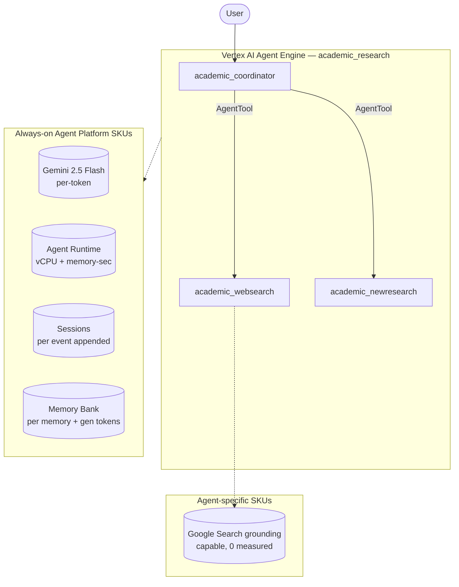

# SKU Usage Summary — `academic-research` (academic_research)

- **Source:** google/adk-samples · **Model:** gemini-2.5-flash · **Engine:** `4540625131680038912`
- **Use case:** Academic literature analysis & discovery · **Complexity:** Medium-High
- **Unit:** 1 interaction = 2-turn conversation + memory-write (2.1 model calls avg), averaged over **35 interactions**. Deployed on Vertex AI Agent Engine (GEAP).
- **Focus:** measured **usage per SKU**; dollar cost is a secondary derived view (§6).

## 1. Architecture

`academic_coordinator` (root) routes between 2 specialist AgentTools:
- `academic_websearch_agent` — searches the web for relevant papers
- `academic_newresearch_agent` — proposes new research directions from findings

Sequential flow: search → analyze → synthesize. Lightweight architecture; cost variability is high (model decides how much to reason).

**Pattern:** Hierarchical (coordinator + AgentTool sub-agents)

## 2. SKUs (products) consumed

Gemini tokens; Agent Runtime (vCPU + memory); Sessions; Memory Bank; Google Search grounding (capable but not triggered in our workloads).

(Sessions + Agent Runtime are automatic on Agent Engine; Memory Bank generation exercised via add_session_to_memory. Search grounding / Imagen used by the agent but usage not yet metered here — see §7.)

## 3. How usage was measured

Deployed to Agent Engine; per run = 2-turn conversation in one session + add_session_to_memory; **35 runs** for variability; 300s Monitoring settle; token usage from the model response (`usage_metadata`, exact), runtime + Memory Bank usage from Cloud Monitoring (per-engine).
Reproduce: `python scripts/exp_sample.py --package academic_research --runs 35 --settle 300`

## 4. SKU usage per interaction (PRIMARY)

Measured usage quantities per interaction (avg over 35 runs), with run-to-run range and variability.

| SKU dimension | Unit | Typical | Range | Variability |
|---|---|---|---|---|
| Gemini input tokens | tokens | 2577 | 1813–14570 | Very high |
| Gemini output tokens (incl. thinking) | tokens | 1384 | 423–6130 | Very high |
| Model calls | calls | 2.1 | — | Medium |
| Agent Runtime — vCPU | vCPU-seconds | 86.9 | — | — |
| Agent Runtime — memory | GiB-seconds | 137.3 | — | — |
| Sessions | events appended | 4.1 | — | Medium |
| Memory Bank — generation | tokens | 2627 | — | — |
| Memory Bank — memories written | memories | 0.1 | — | — |
| Memory Bank — retrievals | reads | 0.0 | — | — |
| Google Search grounding — query turns | grounded turns | 0.34 | — | — |

_Memory retrievals = 0 by design: the harness mints a fresh user_id per interaction and writes memories only at session end, so no user ever has prior memories to retrieve. (Only the chatbot even has a `preload_memory` tool; the others write memories but have no retrieval tool.) The retrieval SKU is exercised by `memory_assistant`, whose workload reuses a user across sessions._

## 5. Grounding & media usage

- **Google Search grounding:** 0.34 grounded query-turns per interaction measured (web_researcher AgentTool invocations; each runs ≥1 native google_search generation). Bills ~$14/1K grounded turns. NOTE: native google_search grounding_metadata is encapsulated inside the AgentTool and the Monitoring web_search_requests metric does not track native ADK google_search — so the AgentTool call count is the measurable unit.
- **Image generation (Imagen):** 0 images measured (from response events). Would bill ~$0.04/image if used.

## 5b. Caveats on usage capture

- vCPU/GiB-seconds are amortized over the measurement window (utilization-dependent).
- Memory storage (stored-memory count over time) is export-only.
- Grounding count is project-wide (no per-engine label); image count is event-based.
- Still uncaptured: Cloud Trace, Logging, Storage.

## 6. Secondary: derived cost (usage × catalog list price)

Provided for reference only. List price, not actual billed; **usage above is the primary output.**

| SKU | $/interaction |
|---|---|
| Gemini tokens | 0.0042 |
| Agent Runtime | 0.0024 |
| Memory Bank + Sessions | 0.0008 |
| Google Search grounding (0.34 grounded turns/intxn @ $14/1K) | 0.004800 |
| Model Armor (derived: 3961 tok scanned @ $0.10/1M) | 0.000396 |
| **Total (measured SKUs)** | **0.0126** (range 0.0049–0.0203) |

## 7. Test workload & sample interactions

**35 interactions** (70 total user turns), fresh user_id per interaction. All interactions repeat the same 2-turn workload to isolate run-to-run variability.

**Workload (turn-by-turn):**

| Turn | User query |
|---|---|
| 1 | Summarize recent research directions in efficient transformer architectures. |
| 2 | Which of those directions looks most promising for edge deployment, and why? |

**Sample interaction (first run):**

- **Turn 1** (819 in / 523 out tokens) — user: *Summarize recent research directions in efficient transformer architectures.*
  - reply preview: Hello! I can certainly help you with that. To provide a thorough analysis of recent research in efficient transformer architectures, I first need a seminal paper on the topic to serve as a starting po…
- **Turn 2** (1356 in / 482 out tokens) — user: *Which of those directions looks most promising for edge deployment, and why?*
  - reply preview: That's an excellent question. To determine which research directions are most promising for edge deployment, I first need to identify the current research directions in efficient transformer architect…

Full transcripts: `data/transcript_academic_research.jsonl` (one JSON record per turn; full input, output_text, every tool call+response, per-step usage). **Not committed** (data/ is gitignored — runtime artifact).