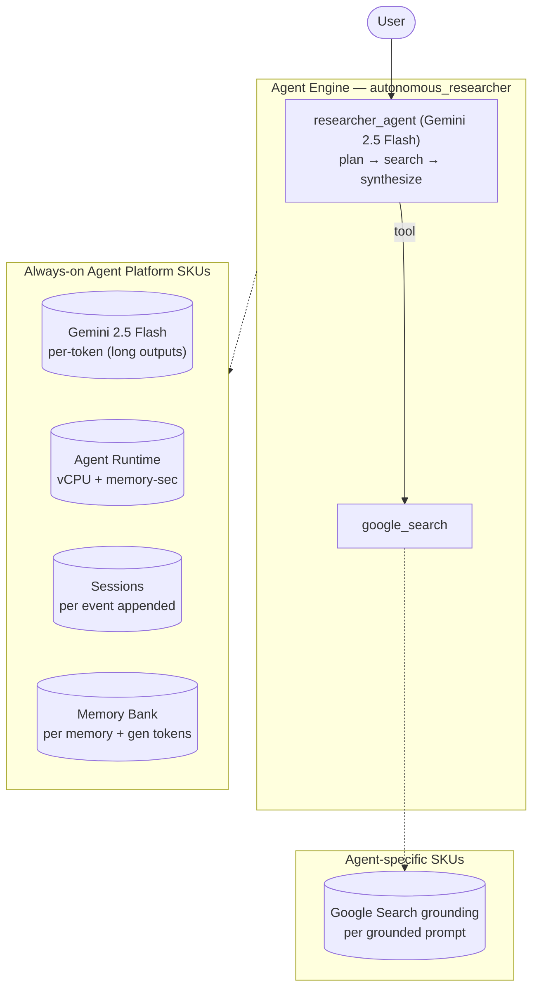

# SKU Usage Summary — `autonomous-researcher (archetype)` (autonomous_researcher)

- **Source:** google/adk-samples · **Model:** gemini-2.5-flash · **Engine:** `7272440935726710784`
- **Use case:** Deep web research with synthesis · **Complexity:** Archetype: Autonomous Researcher / Moderate
- **Unit:** 1 interaction = 2–4-turn (varying) conversation + memory-write (7.8 model calls avg), averaged over **40 interactions**. Deployed on Vertex AI Agent Engine (GEAP).
- **Focus:** measured **usage per SKU**; dollar cost is a secondary derived view (§6).

## 1. Architecture

Deep-research agent (archetype: Autonomous Researcher, Moderate). Plans, grounds on the web via ADK `google_search`, and synthesizes long reports. Token-depth-driven: premium model intent (Gemini Pro), long outputs (~6,000 output tokens/interaction measured), and Search grounding (~69 grounded searches across the run — the first SKU usage that actually exercises Search grounding in this project). Internal-corpus RAG (Vertex AI Search) deferred to the High variant, since google_search must be the sole tool.

**Pattern:** Single agent + Google Search grounding, long outputs

## 2. SKUs (products) consumed

Gemini tokens (long outputs); Agent Runtime (vCPU + memory); Sessions; Memory Bank; **Google Search grounding** (measured non-zero).

(Sessions + Agent Runtime are automatic on Agent Engine; Memory Bank generation exercised via add_session_to_memory. Search grounding / Imagen used by the agent but usage not yet metered here — see §7.)

## 3. How usage was measured

Deployed to Agent Engine; per run = 2–4-turn (varying) conversation in one session + add_session_to_memory; **40 runs** for variability; 300s Monitoring settle; token usage from the model response (`usage_metadata`, exact), runtime + Memory Bank usage from Cloud Monitoring (per-engine).
Reproduce: `python scripts/exp_sample.py --package autonomous_researcher --runs 40 --settle 300`

## 4. SKU usage per interaction (PRIMARY)

Measured usage quantities per interaction (avg over 40 runs), with run-to-run range and variability.

| SKU dimension | Unit | Typical | Range | Variability |
|---|---|---|---|---|
| Gemini input tokens | tokens | 42348 | 16990–92711 | High |
| Gemini output tokens (incl. thinking) | tokens | 8993 | 4939–14742 | Medium |
| Model calls | calls | 7.8 | — | Medium |
| Agent Runtime — vCPU | vCPU-seconds | 407.9 | — | — |
| Agent Runtime — memory | GiB-seconds | 432.2 | — | — |
| Sessions | events appended | 15.5 | — | Medium |
| Memory Bank — generation | tokens | 8202 | — | — |
| Memory Bank — memories written | memories | 0.8 | — | — |
| Memory Bank — retrievals | reads | 0.0 | — | — |
| Firestore — document writes | writes | 1.27 | — | — |
| Firestore — document reads | reads | 1.95 | — | — |
| Vertex AI Search (RAG) — queries | searches | 1.23 | — | — |
| Google Search grounding — query turns | grounded turns | 1.43 | — | — |

_Memory retrievals = 0: this agent has no preload_memory tool — it writes memories from the session but doesn't read them back._

## 5. Grounding & media usage

- **Google Search grounding:** 1.43 grounded query-turns per interaction measured (web_researcher AgentTool invocations; each runs ≥1 native google_search generation). Bills ~$14/1K grounded turns. NOTE: native google_search grounding_metadata is encapsulated inside the AgentTool and the Monitoring web_search_requests metric does not track native ADK google_search — so the AgentTool call count is the measurable unit.
- **Image generation (Imagen):** 0 images measured (from response events). Would bill ~$0.04/image if used.

## 5b. Caveats on usage capture

- vCPU/GiB-seconds are amortized over the measurement window (utilization-dependent).
- Memory storage (stored-memory count over time) is export-only.
- Grounding count is project-wide (no per-engine label); image count is event-based.
- Still uncaptured: Cloud Trace, Logging, Storage.

## 6. Secondary: derived cost (usage × catalog list price)

Provided for reference only. List price, not actual billed; **usage above is the primary output.**

| SKU | $/interaction |
|---|---|
| Gemini tokens | 0.0352 |
| Agent Runtime | 0.0109 |
| Memory Bank + Sessions | 0.0063 |
| Firestore (51w/78r over 40 runs) | 0.0000004 |
| Vertex AI Search (RAG: 1.23 queries/intxn @ $1.50/1K) | 0.001838 |
| Google Search grounding (1.43 grounded turns/intxn @ $14/1K) | 0.019950 |
| Model Armor (derived: 51341 tok scanned @ $0.10/1M) | 0.005134 |
| **Total (measured SKUs)** | **0.0793** (range 0.0347–0.0773) |

## 7. Test workload & sample interactions

**40 interactions** (128 total user turns), fresh user_id per interaction. Interactions cycle **5 distinct conversation scenarios** of varying length (2-turn×8, 3-turn×16, 4-turn×16) — real-world interactions differ in length and topic, so this spreads coverage rather than repeating one script.

**Scenario 1** (2 turns):

| Turn | User query |
|---|---|
| 1 | Research the current state of small modular reactors (SMRs) and their commercial outlook. |
| 2 | Now focus on the main regulatory and cost barriers, and which companies lead. |

**Scenario 2** (3 turns):

| Turn | User query |
|---|---|
| 1 | Research the state of solid-state EV batteries in 2026. |
| 2 | Which companies are closest to mass production, and what hurdles remain? |
| 3 | Summarize the investment outlook. |

**Scenario 3** (3 turns):

| Turn | User query |
|---|---|
| 1 | Research recent advances in direct-air carbon capture. |
| 2 | Compare it with point-source capture on cost and scalability. |
| 3 | Which approach is more likely to scale this decade, and why? |

**Scenario 4** (4 turns):

| Turn | User query |
|---|---|
| 1 | Research the latest in efficient transformer architectures. |
| 2 | Which techniques work best for edge deployment? |
| 3 | How do quantization and distillation compare there? |
| 4 | Summarize the practical recommendation. |

**Scenario 5** (4 turns):

| Turn | User query |
|---|---|
| 1 | Research the RAG vs long-context-window tradeoff for enterprise search. |
| 2 | What are the cost implications of each? |
| 3 | When does hybrid (keyword + vector) retrieval help? |
| 4 | Give a recommended architecture for a 10M-document corpus. |

**Sample interaction (first run):**

- **Turn 1** (11852 in / 7672 out tokens) — user: *Research the current state of small modular reactors (SMRs) and their commercial outlook.*
  - reply preview: ## Research Report: The Current State and Commercial Outlook of Small Modular Reactors (SMRs)  ### Executive Summary  Small Modular Reactors (SMRs) are emerging as a pivotal technology in the global c…
- **Turn 2** (21136 in / 4155 out tokens) — user: *Now focus on the main regulatory and cost barriers, and which companies lead.*
  - reply preview: ## Research Report: Regulatory and Cost Barriers, and Leading Companies in Small Modular Reactor (SMR) Development  ### Executive Summary  The advancement and commercial deployment of Small Modular Re…

Full transcripts: `data/transcript_autonomous_researcher.jsonl` (one JSON record per turn; full input, output_text, every tool call+response, per-step usage). **Not committed** (data/ is gitignored — runtime artifact).