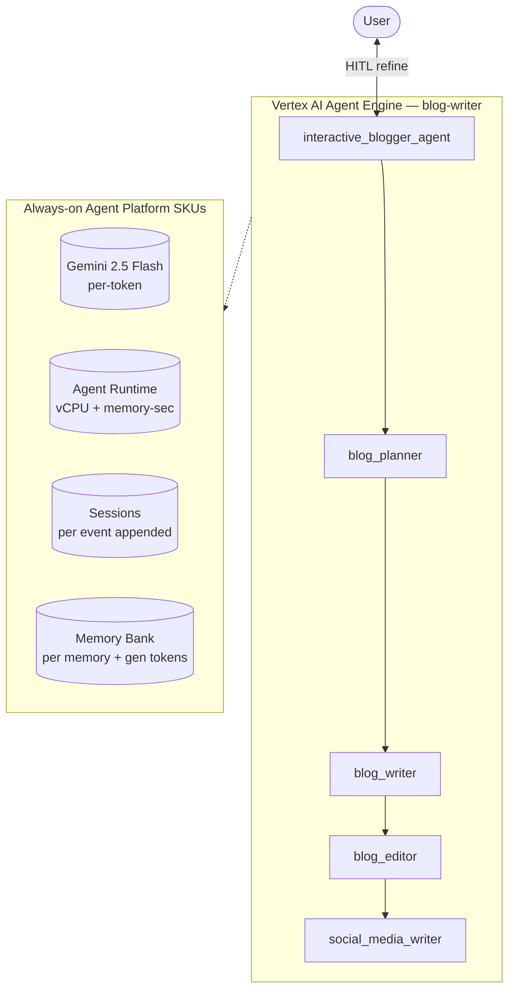

# SKU Usage Summary — `blog-writer` (blogger_agent)

- **Source:** google/adk-samples · **Model:** gemini-2.5-flash · **Engine:** `5724610038794813440`
- **Use case:** Multi-agent technical blog authoring · **Complexity:** High
- **Unit:** 1 interaction = a 2-turn conversation in a single session, followed by a memory-write step (4.8 model calls on average). All numbers below are averaged over **80 interactions**. Deployed on Vertex AI Agent Engine.
- **Focus:** measured **usage per SKU**; dollar cost is a secondary derived view (§6).

## 1. Architecture

`interactive_blogger_agent` orchestrates a 4-stage pipeline of sub-agents:
1. `blog_planner` — outlines structure from the topic
2. `blog_writer` — drafts the post
3. `blog_editor` — refines tone, clarity, structure
4. `social_media_writer` — creates social posts from the blog

Human-in-the-loop: the user can request changes mid-flow and the root re-invokes the relevant sub-agent.

**Pattern:** Hierarchical + Sequential (4 sub-agents) + HITL

## 2. SKUs (products) consumed

Gemini tokens; Agent Runtime (vCPU + memory); Sessions; Memory Bank; Google Search grounding (capable, not triggered).

(Sessions and Agent Runtime are billed automatically by Agent Engine; Memory Bank generation is triggered by `add_session_to_memory`. Where the agent uses Google Search grounding or image generation, that usage is reported in §5.)

## 3. How usage was measured

Each interaction = a 2-turn conversation in one session, followed by `add_session_to_memory` (which triggers Memory Bank generation). We ran **80 interactions** to capture run-to-run variability, waited 300s for Cloud Monitoring metrics to settle, then read usage: token counts come from Cloud Monitoring **`token_count`** — the **complete** total. This agent delegates to sub-agents invoked as callable tools (ADK `AgentTool`), and those sub-agent model calls do not appear in the parent agent's response stream, so a stream-based count undercounts this agent by **1.1075×**; `token_count` captures every model call and corrects it; runtime (vCPU / memory-seconds) and Memory Bank usage come from Cloud Monitoring (per-engine metrics).

## 4. SKU usage per interaction (PRIMARY)

Measured usage quantities per interaction (averaged over 80 interactions), with the min–max range and variability label across interactions.

| SKU dimension | Unit | Typical | Range | Variability |
|---|---|---|---|---|
| Gemini input tokens | tokens | 11345 | 4187–22789 | Medium |
| Gemini output tokens (incl. thinking) | tokens | 5425 | 337–11277 | High |
| Gemini tokens — coordinator agent (input) | tokens | 9268 | — | — |
| Gemini tokens — coordinator agent (output) | tokens | 2689 | — | — |
| Gemini tokens — sub-agents (input) | tokens | 2077 | — | — |
| Gemini tokens — sub-agents (output) | tokens | 2736 | — | — |
| Model calls | calls | 4.8 | — | Medium |
| Agent Runtime — vCPU | vCPU-seconds | 101.3 | — | — |
| Agent Runtime — memory | GiB-seconds | 137.8 | — | — |
| Sessions | events appended | 11.1 | — | Medium |
| Memory Bank — generation | tokens | 4603 | — | — |
| Memory Bank — memories written | memories | 0.3 | — | — |
| Memory Bank — retrievals | reads | 0.3 | — | — |
| Firestore — document writes | writes | 0.00 | — | — |
| Firestore — document reads | reads | 0.95 | — | — |
| Vertex AI Search (RAG) — queries | searches | 0.80 | — | — |
| Google Search grounding | grounded query-turns | 0.50 | — | — |

_**Coordinator vs sub-agent token split** — the share of total Gemini tokens processed by the root coordinator agent versus the sub-agents it delegates to. Measured directly by running the coordinator and the sub-agents on two different model versions (coordinator on gemini-3.5-flash, sub-agents on gemini-3.1-flash-lite) and separating their token counts by model in Cloud Monitoring — this is the **master/sub** split in the two-model measurement. The input-vs-output breakdown within each role is allocated by the measured per-role input:output ratio (coordinator ≈ 88:12, sub-agents ≈ 61:39). Single-agent agents have no sub-agents, so they are 100% coordinator._

## 5. Grounding & media usage

- **Google Search grounding:** 0.50 grounded query-turns per interaction. Grounding runs inside a dedicated web-research sub-agent that the coordinator invokes as a tool (ADK `AgentTool`); each call issues one or more native `google_search` requests and returns grounded results. We count each web-research call as one grounded query-turn — the billable unit (~$14 / 1K grounded query-turns). Native `google_search` grounding is encapsulated inside the AgentTool and is not tracked by Cloud Monitoring's `web_search_requests` metric, so the AgentTool call count is the reliable measure.
- **Image generation (Imagen):** none in this workload. (Would bill ~$0.04 / image if used.)

## 5b. Caveats on usage capture

- **Agent Runtime (vCPU / GiB-seconds)** is the engine's allocated compute amortized over the measurement window, so it depends on utilization (queries per hour). Treat it as an upper bound, not actual billed instance-time.
- **Memory storage** (the number of stored memories accruing over time) is not captured here — it is only available from the billing export.
- **Grounding** is counted from the agent's tool calls (Cloud Monitoring's grounding metric is project-wide, with no per-engine label); **Imagen** image counts come from response events.
- **Not yet captured:** Cloud Trace, Cloud Logging, Cloud Storage.

## 6. Secondary: derived cost (usage × catalog list price)

Provided for reference only. List price, not actual billed; **usage above is the primary output.**

| SKU | $/interaction |
|---|---|
| Gemini tokens | 0.0170 |
| Agent Runtime | 0.0058 |
| Memory Bank + Sessions | 0.0043 |
| Firestore (0 writes / 76 reads over 80 interactions) | 0.0000000 |
| Vertex AI Search (RAG: 0.80 queries/interaction @ $1.50/1K) | 0.001200 |
| Google Search grounding (0.50 grounded query-turns/interaction @ $14/1K) | 0.007000 |
| Memory Bank retrieval (0.31 memories retrieved/interaction @ $0.5/1K) | 0.000156 |
| Model Armor (derived: 16770 tok scanned @ $0.10/1M) | 0.001677 |
| Search grounding | 0.0267 |
| **Total (measured SKUs)** | **0.0638** (range 0.0389–0.0719) |

## 7. Test workload & sample interactions

Each interaction used a fresh user id. The workload draws from **1 distinct conversation scenarios** of varying length (2–16 turns); real-world conversations differ in length and topic, so cycling several scenarios spreads coverage rather than repeating a single script. Longer interactions repeat these same base scenarios to exercise multi-turn cost scaling.

**Scenario 1** (2 turns):

| Turn | User query |
|---|---|
| 1 | Write a short technical blog post about why vector databases matter for RAG. |
| 2 | Make the intro punchier and add a one-line takeaway at the end. |

**Sample interaction (first run):**

- **Turn 1** (2567 in / 247 out tokens) — user: *Write a short technical blog post about why vector databases matter for RAG.*
  - reply preview: 
- **Turn 2** (2051 in / 3073 out tokens) — user: *Make the intro punchier and add a one-line takeaway at the end.*
  - reply preview: ## Blog Post Outline: Unlocking Smarter LLMs: Why Vector Databases Are Indispensable for RAG  ### I. Introduction: The LLM's Double-Edged Sword  *   **The Promise and Peril of LLMs:** Large Language M…

Full transcripts: `data/transcript_blogger_agent.jsonl` (one JSON record per turn; full input, output_text, every tool call+response, per-step usage). **Not committed** (data/ is gitignored — runtime artifact).