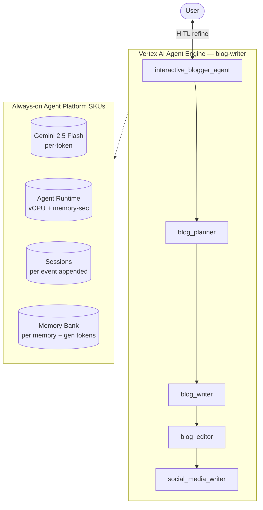

# SKU Usage Summary — `blog-writer` (blogger_agent)

- **Source:** google/adk-samples · **Model:** gemini-2.5-flash · **Engine:** `3729977198753349632`
- **Use case:** Multi-agent technical blog authoring · **Complexity:** High
- **Unit:** 1 interaction = 2-turn conversation + memory-write (2.0 model calls avg). Deployed on Vertex AI Agent Engine (GEAP).
- **Focus:** measured **usage per SKU**; dollar cost is a secondary derived view (§6).

## 1. Architecture

`interactive_blogger_agent` orchestrates a 4-stage pipeline of sub-agents:
1. `blog_planner` — outlines structure from the topic
2. `blog_writer` — drafts the post
3. `blog_editor` — refines tone, clarity, structure
4. `social_media_writer` — creates social posts from the blog

Human-in-the-loop: the user can request changes mid-flow and the root re-invokes the relevant sub-agent.

**Pattern:** Hierarchical + Sequential (4 sub-agents) + HITL

## 2. SKUs (products) consumed

Gemini tokens; Agent Runtime (vCPU + memory); Sessions; Memory Bank; Google Search grounding (capable, not triggered).

(Sessions + Agent Runtime are automatic on Agent Engine; Memory Bank generation exercised via add_session_to_memory. Search grounding / Imagen used by the agent but usage not yet metered here — see §7.)

## 3. How usage was measured

Deployed to Agent Engine; per run = 2-turn conversation in one session + add_session_to_memory; **3 runs** for variability; 300s Monitoring settle; token usage from the model response (`usage_metadata`, exact), runtime + Memory Bank usage from Cloud Monitoring (per-engine).
Reproduce: `python scripts/exp_sample.py --package blogger_agent --runs 3 --settle 300`

## 4. SKU usage per interaction (PRIMARY)

Measured usage quantities per interaction (avg over 3 runs), with run-to-run range and variability.

| SKU dimension | Unit | Typical | Range | Variability |
|---|---|---|---|---|
| Gemini input tokens | tokens | 3027 | 2543–3415 | Low |
| Gemini output tokens (incl. thinking) | tokens | 3039 | 2527–3564 | Low |
| Model calls | calls | 2.0 | — | Low |
| Agent Runtime — vCPU | vCPU-seconds | 164.0 | — | — |
| Agent Runtime — memory | GiB-seconds | 640.4 | — | — |
| Sessions | events appended | 4.0 | — | Low |
| Memory Bank — generation | tokens | 3959 | — | — |
| Memory Bank — memories written | memories | 1.0 | — | — |
| Memory Bank — retrievals | reads | 0.0 | — | — |

_Memory retrievals = 0: this agent has no preload_memory tool — it writes memories from the session but doesn't read them back._

## 5. Grounding & media usage (now collected)

- **Google Search grounding:** 0 grounded web-search requests measured (Cloud Monitoring, project-wide). The agent *can* ground on Search but this workload did not trigger it; would bill ~$0.035/request if used.
- **Image generation (Imagen):** 0 images measured (from response events). Would bill ~$0.04/image if used.

## 5b. Caveats on usage capture

- vCPU/GiB-seconds are amortized over the measurement window (utilization-dependent).
- Memory storage (stored-memory count over time) is export-only.
- Grounding count is project-wide (no per-engine label); image count is event-based.
- Still uncaptured: Cloud Trace, Logging, Storage.

## 6. Secondary: derived cost (usage × catalog list price)

Provided for reference only. List price, not actual billed; **usage above is the primary output.**

| SKU | $/interaction |
|---|---|
| Gemini tokens | 0.0085 |
| Agent Runtime | 0.0055 |
| Memory Bank + Sessions | 0.0015 |
| **Total (measured SKUs)** | **0.0156** (range 0.0141–0.0170) |