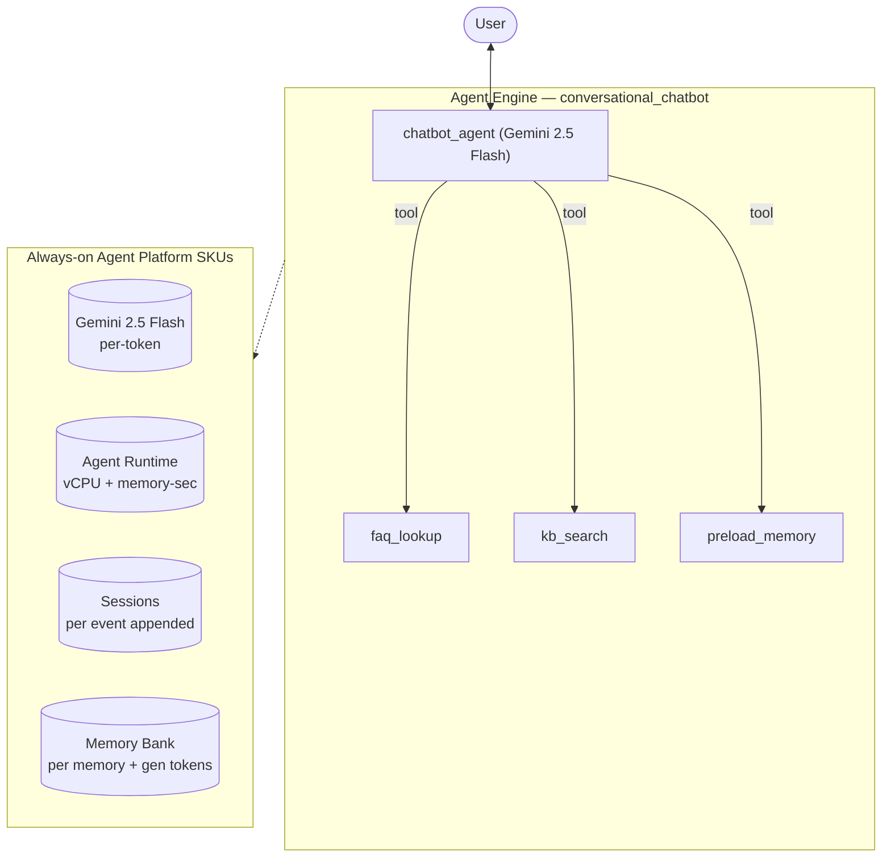

# SKU Usage Summary — `conversational-chatbot (archetype)` (conversational_chatbot)

- **Source:** google/adk-samples · **Model:** gemini-2.5-flash · **Engine:** `1422968707214213120`
- **Use case:** Customer-support Q&A chatbot · **Complexity:** Archetype: Conversational Chatbot / Moderate
- **Unit:** 1 interaction = 2-turn conversation + memory-write (5.5 model calls avg). Deployed on Vertex AI Agent Engine (GEAP).
- **Focus:** measured **usage per SKU**; dollar cost is a secondary derived view (§6).

## 1. Architecture

Single user-facing support agent (archetype: Conversational Chatbot, Moderate). Light tool use — `faq_lookup` + `kb_search` (stand-ins for a BigQuery/KB lookup) — and `preload_memory` for returning-user personalization. Volume-driven archetype: cheap model, short turns. Measured ~4 model calls / ~8 session events per 2-turn interaction.

**Pattern:** Single agent + light tools + Memory Bank

## 2. SKUs (products) consumed

Gemini tokens; Agent Runtime (vCPU + memory); Sessions; Memory Bank. (BigQuery/KB lookup mocked locally — would bill BigQuery in production.)

(Sessions + Agent Runtime are automatic on Agent Engine; Memory Bank generation exercised via add_session_to_memory. Search grounding / Imagen used by the agent but usage not yet metered here — see §7.)

## 3. How usage was measured

Deployed to Agent Engine; per run = 2-turn conversation in one session + add_session_to_memory; **40 runs** for variability; 300s Monitoring settle; token usage from the model response (`usage_metadata`, exact), runtime + Memory Bank usage from Cloud Monitoring (per-engine).
Reproduce: `python scripts/exp_sample.py --package conversational_chatbot --runs 40 --settle 300`

## 4. SKU usage per interaction (PRIMARY)

Measured usage quantities per interaction (avg over 40 runs), with run-to-run range and variability.

| SKU dimension | Unit | Typical | Range | Variability |
|---|---|---|---|---|
| Gemini input tokens | tokens | 3033 | 1732–6853 | High |
| Gemini output tokens (incl. thinking) | tokens | 414 | 184–811 | High |
| Model calls | calls | 5.5 | — | Medium |
| Agent Runtime — vCPU | vCPU-seconds | 38.3 | — | — |
| Agent Runtime — memory | GiB-seconds | 90.1 | — | — |
| Sessions | events appended | 11.1 | — | Medium |
| Memory Bank — generation | tokens | 0 | — | — |
| Memory Bank — memories written | memories | 0.0 | — | — |
| Memory Bank — retrievals | reads | 0.0 | — | — |
| Firestore — document writes | writes | 0.05 | — | — |
| Firestore — document reads | reads | 0.03 | — | — |

_Memory retrievals = 0: this agent has no preload_memory tool — it writes memories from the session but doesn't read them back._

## 5. Grounding & media usage (now collected)

- **Google Search grounding:** 0 grounded web-search requests measured (Cloud Monitoring, project-wide). The agent *can* ground on Search but this workload did not trigger it; would bill ~$0.035/request if used.
- **Image generation (Imagen):** 0 images measured (from response events). Would bill ~$0.04/image if used.

## 5b. Caveats on usage capture

- vCPU/GiB-seconds are amortized over the measurement window (utilization-dependent).
- Memory storage (stored-memory count over time) is export-only.
- Grounding count is project-wide (no per-engine label); image count is event-based.
- Still uncaptured: Cloud Trace, Logging, Storage.

## 6. Secondary: derived cost (usage × catalog list price)

Provided for reference only. List price, not actual billed; **usage above is the primary output.**

| SKU | $/interaction |
|---|---|
| Gemini tokens | 0.0019 |
| Agent Runtime | 0.0011 |
| Memory Bank + Sessions | 0.0028 |
| Firestore (2w/1r over 40 runs) | 0.0000000 |
| **Total (measured SKUs)** | **0.0058** (range 0.0051–0.0078) |

## 7. Test workload & sample interactions

**40 interactions** (120 total user turns), fresh user_id per interaction. Interactions cycle **4 distinct conversation scenarios** of varying length (2-turn×10, 3-turn×20, 4-turn×10) — real-world interactions differ in length and topic, so this spreads coverage rather than repeating one script.

**Scenario 1** (2 turns):

| Turn | User query |
|---|---|
| 1 | How do I reset my password, and what are your support hours? |
| 2 | Also, what are your pricing tiers and do you support SSO? |

**Scenario 2** (3 turns):

| Turn | User query |
|---|---|
| 1 | I'd like a refund on my last order. |
| 2 | How long does that take to process? |
| 3 | Can it go to a different card than I paid with? |

**Scenario 3** (4 turns):

| Turn | User query |
|---|---|
| 1 | Do you integrate with Slack? |
| 2 | What about exporting my data? |
| 3 | Is data export on the Pro tier or Enterprise only? |
| 4 | Okay — how do I upgrade my plan? |

**Scenario 4** (3 turns):

| Turn | User query |
|---|---|
| 1 | My shipment hasn't arrived yet. |
| 2 | It's order ORD-1002. What's the ETA? |
| 3 | Can you switch it to express? |

**Sample interaction (first run):**

- **Turn 1** (801 in / 157 out tokens) — user: *How do I reset my password, and what are your support hours?*
  - reply preview: I can't find information about password resets or support hours in our FAQs. Would you like me to escalate this to a support agent who can help you further?
- **Turn 2** (1208 in / 137 out tokens) — user: *Also, what are your pricing tiers and do you support SSO?*
  - reply preview: Our pricing tiers are: Starter ($0), Pro ($29/month), and Enterprise (please contact sales for more information).  Yes, SSO (SAML/OIDC) is supported and available on the Enterprise tier. Please contac…

Full transcripts: `data/transcript_conversational_chatbot.jsonl` (one JSON record per turn; full input, output_text, every tool call+response, per-step usage). **Not committed** (data/ is gitignored — runtime artifact).