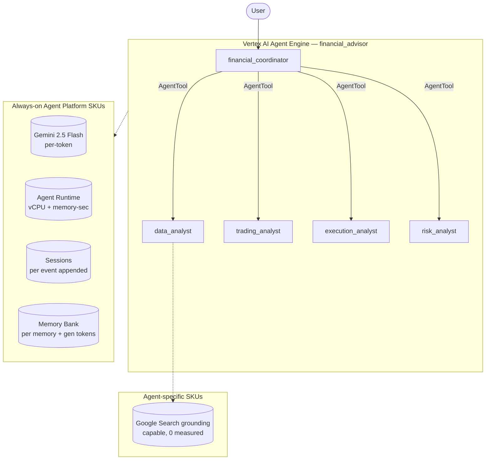

# SKU Usage Summary — `financial-advisor` (financial_advisor)

- **Source:** google/adk-samples · **Model:** gemini-2.5-flash · **Engine:** `5907850248633450496`
- **Use case:** Stock analysis & trading-strategy advisor · **Complexity:** High
- **Unit:** 1 interaction = 2-turn conversation + memory-write (3.6 model calls avg), averaged over **40 interactions**. Deployed on Vertex AI Agent Engine (GEAP).
- **Focus:** measured **usage per SKU**; dollar cost is a secondary derived view (§6).

## 1. Architecture

`financial_coordinator` (root) delegates to 4 specialist sub-agents wrapped as AgentTools, each its own LlmAgent:
- `data_analyst` — fetches and analyzes market/ticker data
- `trading_analyst` — proposes a trading strategy from the data
- `execution_analyst` — defines an execution plan (timing, sizing)
- `risk_analyst` — assesses risks of the proposed strategy

A single user query fans out to multiple model calls; in EXP-006 it consumed 17k–34k input tokens per interaction (heaviest input-token consumer in the corpus).

**Pattern:** Hierarchical (coordinator + 4 AgentTool specialists)

## 2. SKUs (products) consumed

Gemini tokens (input/output/cached); Agent Runtime (vCPU + memory); Sessions; Memory Bank (generation + writes); Google Search grounding (capable but not triggered).

(Sessions + Agent Runtime are automatic on Agent Engine; Memory Bank generation exercised via add_session_to_memory. Search grounding / Imagen used by the agent but usage not yet metered here — see §7.)

## 3. How usage was measured

Deployed to Agent Engine; per run = 2-turn conversation in one session + add_session_to_memory; **40 runs** for variability; 300s Monitoring settle; token usage from the model response (`usage_metadata`, exact), runtime + Memory Bank usage from Cloud Monitoring (per-engine).
Reproduce: `python scripts/exp_sample.py --package financial_advisor --runs 40 --settle 300`

## 4. SKU usage per interaction (PRIMARY)

Measured usage quantities per interaction (avg over 40 runs), with run-to-run range and variability.

| SKU dimension | Unit | Typical | Range | Variability |
|---|---|---|---|---|
| Gemini input tokens | tokens | 27586 | 3667–139557 | Very high |
| Gemini output tokens (incl. thinking) | tokens | 1724 | 780–8097 | Very high |
| Model calls | calls | 3.6 | — | Medium |
| Agent Runtime — vCPU | vCPU-seconds | 347.5 | — | — |
| Agent Runtime — memory | GiB-seconds | 420.3 | — | — |
| Sessions | events appended | 7.3 | — | Low |
| Memory Bank — generation | tokens | 3377 | — | — |
| Memory Bank — memories written | memories | 0.8 | — | — |
| Memory Bank — retrievals | reads | 0.0 | — | — |
| Firestore — document writes | writes | 0.00 | — | — |
| Firestore — document reads | reads | 0.93 | — | — |
| Vertex AI Search (RAG) — queries | searches | 0.17 | — | — |

_Memory retrievals = 0 by design: the harness mints a fresh user_id per interaction and writes memories only at session end, so no user ever has prior memories to retrieve. (Only the chatbot even has a `preload_memory` tool; the others write memories but have no retrieval tool.) The retrieval SKU is exercised by `memory_assistant`, whose workload reuses a user across sessions._

## 5. Grounding & media usage

- **Google Search grounding:** 0 measured. The agent does not use google_search in this workload; would bill ~$14/1K grounded turns if used.
- **Image generation (Imagen):** 0 images measured (from response events). Would bill ~$0.04/image if used.

## 5b. Caveats on usage capture

- vCPU/GiB-seconds are amortized over the measurement window (utilization-dependent).
- Memory storage (stored-memory count over time) is export-only.
- Grounding count is project-wide (no per-engine label); image count is event-based.
- Still uncaptured: Cloud Trace, Logging, Storage.

## 6. Secondary: derived cost (usage × catalog list price)

Provided for reference only. List price, not actual billed; **usage above is the primary output.**

| SKU | $/interaction |
|---|---|
| Gemini tokens | 0.0126 |
| Agent Runtime | 0.0094 |
| Memory Bank + Sessions | 0.0029 |
| Firestore (0w/37r over 40 runs) | 0.0000000 |
| Vertex AI Search (RAG: 0.17 queries/intxn @ $1.50/1K) | 0.000262 |
| Model Armor (derived: 29310 tok scanned @ $0.10/1M) | 0.002931 |
| **Total (measured SKUs)** | **0.0280** (range 0.0160–0.0587) |

## 7. Test workload & sample interactions

**40 interactions** (80 total user turns), fresh user_id per interaction. All interactions repeat the same 2-turn workload to isolate run-to-run variability.

**Workload (turn-by-turn):**

| Turn | User query |
|---|---|
| 1 | I'm a moderate-risk investor. Analyze the outlook for NVDA. |
| 2 | Based on that, suggest a simple trading strategy and key risks. |

**Sample interaction (first run):**

- **Turn 1** (3717 in / 801 out tokens) — user: *I'm a moderate-risk investor. Analyze the outlook for NVDA.*
  - reply preview: Hello! I'm here to help you navigate the world of financial decision-making. My main goal is to provide you with comprehensive financial advice by guiding you through a step-by-step process. We'll wor…
- **Turn 2** (2386 in / 199 out tokens) — user: *Based on that, suggest a simple trading strategy and key risks.*
  - reply preview: I understand you're eager to get to the strategies and risks! However, to provide you with the most accurate and relevant advice, we need to follow a structured process.  We are currently on the first…

Full transcripts: `data/transcript_financial_advisor.jsonl` (one JSON record per turn; full input, output_text, every tool call+response, per-step usage). **Not committed** (data/ is gitignored — runtime artifact).