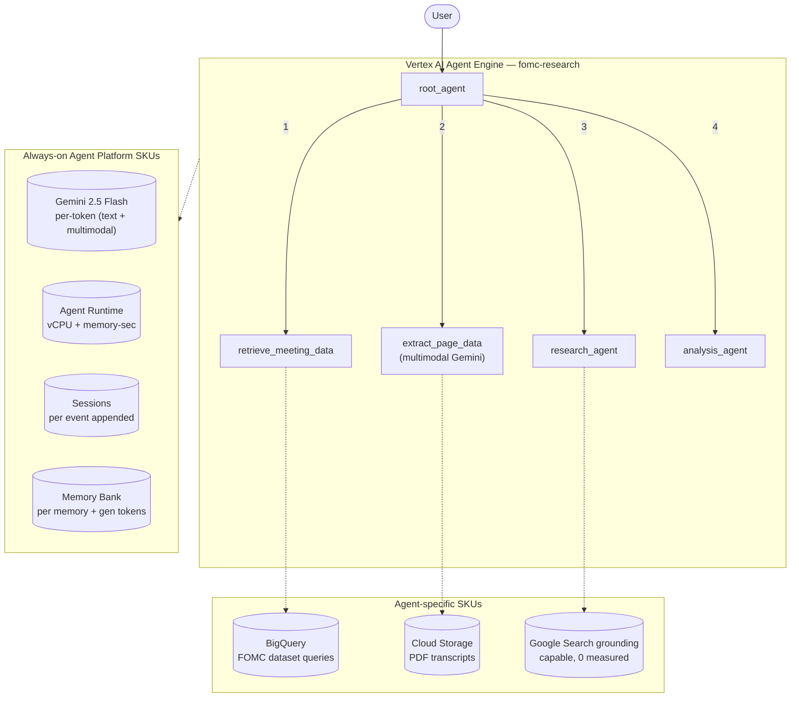

# SKU Usage Summary — `fomc-research` (fomc_research)

- **Source:** google/adk-samples · **Model:** gemini-2.5-flash · **Engine:** `1464961255302234112`
- **Use case:** FOMC meeting financial-analysis report · **Complexity:** High
- **Unit:** 1 interaction = 2-turn conversation + memory-write (4.7 model calls avg), averaged over **80 interactions**. Deployed on Vertex AI Agent Engine (GEAP).
- **Focus:** measured **usage per SKU**; dollar cost is a secondary derived view (§6).

## 1. Architecture

Hierarchical multi-stage research pipeline. Root agent coordinates 4 sub-agents in sequence:
- `retrieve_meeting_data_agent` — fetches FOMC meeting metadata from **BigQuery**
- `extract_page_data_agent` — downloads + parses official PDF transcripts (pdfplumber + Cloud Storage), then runs **multimodal Gemini** on the PDFs
- `research_agent` — gathers contextual web background
- `analysis_agent` — synthesizes the final report on rates / inflation outlook

Multimodal: passes raw PDF documents to Gemini as inputs (not just text).

**Pattern:** Hierarchical + Sequential, multimodal pipeline

## 2. SKUs (products) consumed

Gemini tokens (text + multimodal); Agent Runtime (vCPU + memory); Sessions; Memory Bank; **BigQuery** (FOMC dataset queries); **Cloud Storage** (PDF downloads); Google Search grounding (research_agent, capable but didn't trigger in our prompts).

(Sessions + Agent Runtime are automatic on Agent Engine; Memory Bank generation exercised via add_session_to_memory. Search grounding / Imagen used by the agent but usage not yet metered here — see §7.)

## 3. How usage was measured

Deployed to Agent Engine; per run = 2-turn conversation in one session + add_session_to_memory; **80 runs** for variability; 300s Monitoring settle; token usage from Cloud Monitoring **`token_count`** (the complete total — captures AgentTool sub-agent tokens the stream misses; undercount factor **2.1925×** vs `usage_metadata`), runtime + Memory Bank usage from Cloud Monitoring (per-engine).
Reproduce: `python scripts/exp_sample.py --package fomc_research --runs 80 --settle 300`

## 4. SKU usage per interaction (PRIMARY)

Measured usage quantities per interaction (avg over 80 runs), with run-to-run range and variability.

| SKU dimension | Unit | Typical | Range | Variability |
|---|---|---|---|---|
| Gemini input tokens | tokens | 27327 | 4930–172106 | Very high |
| Gemini output tokens (incl. thinking) | tokens | 2103 | 221–7832 | Very high |
| Gemini tokens — master/coordinator (input) | tokens | 13067 | — | — |
| Gemini tokens — master/coordinator (output) | tokens | 353 | — | — |
| Gemini tokens — sub-agents/tools (input) | tokens | 14260 | — | — |
| Gemini tokens — sub-agents/tools (output) | tokens | 1750 | — | — |
| Model calls | calls | 4.7 | — | Very high |
| Agent Runtime — vCPU | vCPU-seconds | 208.5 | — | — |
| Agent Runtime — memory | GiB-seconds | 261.2 | — | — |
| Sessions | events appended | 9.8 | — | Very high |
| Memory Bank — generation | tokens | 2460 | — | — |
| Memory Bank — memories written | memories | 0.0 | — | — |
| Memory Bank — retrievals | reads | 0.1 | — | — |
| Firestore — document writes | writes | 0.19 | — | — |
| Firestore — document reads | reads | 0.66 | — | — |
| Vertex AI Search (RAG) — queries | searches | 0.65 | — | — |
| Google Search grounding — query turns | grounded turns | 0.66 | — | — |

_Master vs sub-agent split: each agent's master/sub token share is measured directly (two-model validation — coordinator on gemini-3.5-flash, sub-agents/tools on gemini-3.1-flash-lite, separated via Cloud Monitoring `token_count` by model). The four input/output × master/sub values reconcile both the master/sub totals and the input/output totals (seeded by the measured per-role in:out ratio — master 88:12, sub 61:39). Single-agent agents are 100% master._

## 5. Grounding & media usage

- **Google Search grounding:** 0.66 grounded query-turns per interaction measured (web_researcher AgentTool invocations; each runs ≥1 native google_search generation). Bills ~$14/1K grounded turns. NOTE: native google_search grounding_metadata is encapsulated inside the AgentTool and the Monitoring web_search_requests metric does not track native ADK google_search — so the AgentTool call count is the measurable unit.
- **Image generation (Imagen):** 0 images measured (from response events). Would bill ~$0.04/image if used.

## 5b. Caveats on usage capture

- vCPU/GiB-seconds are amortized over the measurement window (utilization-dependent).
- Memory storage (stored-memory count over time) is export-only.
- Grounding count is project-wide (no per-engine label); image count is event-based.
- Still uncaptured: Cloud Trace, Logging, Storage.

## 6. Secondary: derived cost (usage × catalog list price)

Provided for reference only. List price, not actual billed; **usage above is the primary output.**

| SKU | $/interaction |
|---|---|
| Gemini tokens | 0.0135 |
| Agent Runtime | 0.0000 |
| Memory Bank + Sessions | 0.0007 |
| Firestore (15w/53r over 80 runs) | 0.0000001 |
| Vertex AI Search (RAG: 0.65 queries/intxn @ $1.50/1K) | 0.000975 |
| Google Search grounding (0.66 grounded turns/intxn @ $14/1K) | 0.009275 |
| Memory Bank retrieval (0.07 memories retrieved/intxn @ $0.5/1K) | 0.000037 |
| Model Armor (derived: 29430 tok scanned @ $0.10/1M) | 0.002943 |
| **Total (measured SKUs)** | **0.0274** (range 0.0028–0.0719) |

## 7. Test workload & sample interactions

**5 interactions** (160 total user turns), fresh user_id per interaction. All interactions repeat the same 2-turn workload to isolate run-to-run variability.

**Workload (turn-by-turn):**

| Turn | User query |
|---|---|
| 1 | Summarize the key economic themes from the most recent FOMC meeting. |
| 2 | What was the FOMC's stance on inflation outlook and interest-rate trajectory? |
| 3 | Summarize the key economic themes from the most recent FOMC meeting. |
| 4 | What was the FOMC's stance on inflation outlook and interest-rate trajectory? |
| 5 | Summarize the key economic themes from the most recent FOMC meeting. |
| 6 | What was the FOMC's stance on inflation outlook and interest-rate trajectory? |
| 7 | Summarize the key economic themes from the most recent FOMC meeting. |
| 8 | What was the FOMC's stance on inflation outlook and interest-rate trajectory? |
| 9 | Summarize the key economic themes from the most recent FOMC meeting. |
| 10 | What was the FOMC's stance on inflation outlook and interest-rate trajectory? |
| 11 | Summarize the key economic themes from the most recent FOMC meeting. |
| 12 | What was the FOMC's stance on inflation outlook and interest-rate trajectory? |
| 13 | Summarize the key economic themes from the most recent FOMC meeting. |
| 14 | What was the FOMC's stance on inflation outlook and interest-rate trajectory? |
| 15 | Summarize the key economic themes from the most recent FOMC meeting. |
| 16 | What was the FOMC's stance on inflation outlook and interest-rate trajectory? |
| 17 | Summarize the key economic themes from the most recent FOMC meeting. |
| 18 | What was the FOMC's stance on inflation outlook and interest-rate trajectory? |
| 19 | Summarize the key economic themes from the most recent FOMC meeting. |
| 20 | What was the FOMC's stance on inflation outlook and interest-rate trajectory? |
| 21 | Summarize the key economic themes from the most recent FOMC meeting. |
| 22 | What was the FOMC's stance on inflation outlook and interest-rate trajectory? |
| 23 | Summarize the key economic themes from the most recent FOMC meeting. |
| 24 | What was the FOMC's stance on inflation outlook and interest-rate trajectory? |
| 25 | Summarize the key economic themes from the most recent FOMC meeting. |
| 26 | What was the FOMC's stance on inflation outlook and interest-rate trajectory? |
| 27 | Summarize the key economic themes from the most recent FOMC meeting. |
| 28 | What was the FOMC's stance on inflation outlook and interest-rate trajectory? |
| 29 | Summarize the key economic themes from the most recent FOMC meeting. |
| 30 | What was the FOMC's stance on inflation outlook and interest-rate trajectory? |
| 31 | Summarize the key economic themes from the most recent FOMC meeting. |
| 32 | What was the FOMC's stance on inflation outlook and interest-rate trajectory? |

**Sample interaction (first run):**

- **Turn 1** (3275 in / 232 out tokens) — user: *Summarize the key economic themes from the most recent FOMC meeting.*
  - reply preview: Please provide the date of the FOMC meeting you would like me to analyze.
- **Turn 2** (2280 in / 121 out tokens) — user: *What was the FOMC's stance on inflation outlook and interest-rate trajectory?*
  - reply preview: I can answer that for you, but I need to know the date of the FOMC meeting you are interested in. Once I have the meeting date, I can retrieve the relevant information and provide you with the FOMC's …
- **Turn 3** (1048 in / 438 out tokens) — user: *Summarize the key economic themes from the most recent FOMC meeting.*
  - reply preview: 
- **Turn 4** (1503 in / 307 out tokens) — user: *What was the FOMC's stance on inflation outlook and interest-rate trajectory?*
  - reply preview: 
- **Turn 5** (1995 in / 230 out tokens) — user: *Summarize the key economic themes from the most recent FOMC meeting.*
  - reply preview: I am starting by comparing the requested and previous FOMC statements to generate an HTML redline file. This will highlight the changes between the two statements.
- **Turn 6** (1129 in / 77 out tokens) — user: *What was the FOMC's stance on inflation outlook and interest-rate trajectory?*
  - reply preview: Now, I am retrieving the transcript from the Fed website to gather more information about the meeting.
- **Turn 7** (1995 in / 392 out tokens) — user: *Summarize the key economic themes from the most recent FOMC meeting.*
  - reply preview: I'm starting by comparing the requested and previous FOMC statements to highlight any changes.
- **Turn 8** (1291 in / 60 out tokens) — user: *What was the FOMC's stance on inflation outlook and interest-rate trajectory?*
  - reply preview: Now, I'm fetching the transcript from the Fed website.
- **Turn 9** (1995 in / 280 out tokens) — user: *Summarize the key economic themes from the most recent FOMC meeting.*
  - reply preview: Okay, I'm starting by comparing the requested and previous FOMC statements to highlight the differences. This will help us understand any shifts in their language.
- **Turn 10** (1166 in / 105 out tokens) — user: *What was the FOMC's stance on inflation outlook and interest-rate trajectory?*
  - reply preview: Next, I'm retrieving the transcript of the press conference. This will provide the full details of the meeting discussions.
- **Turn 11** (63055 in / 3366 out tokens) — user: *Summarize the key economic themes from the most recent FOMC meeting.*
  - reply preview: I'm retrieving the main FOMC calendars page from the Federal Reserve website. Now I'm extracting the relevant meeting dates and URLs from the page. I'm now fetching the web page for the requested meet…
- **Turn 12** (4127 in / 180 out tokens) — user: *What was the FOMC's stance on inflation outlook and interest-rate trajectory?*
  - reply preview: I've computed the interest rate move probabilities. I'm now transferring to the analysis agent to complete the analysis and address your question about the FOMC's stance on inflation outlook and inter…
- **Turn 13** (9555 in / 1152 out tokens) — user: *Summarize the key economic themes from the most recent FOMC meeting.*
  - reply preview: To summarize the key economic themes from the most recent FOMC meeting, please provide the date of the meeting you would like me to analyze.
- **Turn 14** (3201 in / 131 out tokens) — user: *What was the FOMC's stance on inflation outlook and interest-rate trajectory?*
  - reply preview: I need to know the date of the FOMC meeting you're interested in before I can tell you about their stance on the inflation outlook and interest-rate trajectory. Please provide the meeting date.
- **Turn 15** (1048 in / 255 out tokens) — user: *Summarize the key economic themes from the most recent FOMC meeting.*
  - reply preview: 
- **Turn 16** (1320 in / 209 out tokens) — user: *What was the FOMC's stance on inflation outlook and interest-rate trajectory?*
  - reply preview: 
- **Turn 17** (14665 in / 1904 out tokens) — user: *Summarize the key economic themes from the most recent FOMC meeting.*
  - reply preview: I will now compare the requested and previous FOMC statements to generate an HTML redline file.
- **Turn 18** (3359 in / 268 out tokens) — user: *What was the FOMC's stance on inflation outlook and interest-rate trajectory?*
  - reply preview: I have compared the statements. Now I will retrieve the transcript of the meeting.
- **Turn 19** (1995 in / 286 out tokens) — user: *Summarize the key economic themes from the most recent FOMC meeting.*
  - reply preview: I'm starting by comparing the requested and previous FOMC statements to highlight the changes.
- **Turn 20** (1185 in / 139 out tokens) — user: *What was the FOMC's stance on inflation outlook and interest-rate trajectory?*
  - reply preview: I've completed comparing the statements. Now I'm retrieving the transcript from the Fed website.
- **Turn 21** (1995 in / 255 out tokens) — user: *Summarize the key economic themes from the most recent FOMC meeting.*
  - reply preview: I will start by generating an HTML redline file showing the differences between the requested and previous FOMC statements.
- **Turn 22** (1153 in / 100 out tokens) — user: *What was the FOMC's stance on inflation outlook and interest-rate trajectory?*
  - reply preview: I am retrieving the transcript of the meeting.
- **Turn 23** (1995 in / 212 out tokens) — user: *Summarize the key economic themes from the most recent FOMC meeting.*
  - reply preview: Okay, I'm starting by comparing the requested and previous FOMC statements to highlight any changes.
- **Turn 24** (1112 in / 131 out tokens) — user: *What was the FOMC's stance on inflation outlook and interest-rate trajectory?*
  - reply preview: Next, I'll retrieve the transcript of the press conference. This will provide more details on the FOMC's views on inflation and the interest rate trajectory.
- **Turn 25** (1048 in / 157 out tokens) — user: *Summarize the key economic themes from the most recent FOMC meeting.*
  - reply preview: Please provide the date of the FOMC meeting you would like me to analyze.
- **Turn 26** (1222 in / 91 out tokens) — user: *What was the FOMC's stance on inflation outlook and interest-rate trajectory?*
  - reply preview: 
- **Turn 27** (3502 in / 1281 out tokens) — user: *Summarize the key economic themes from the most recent FOMC meeting.*
  - reply preview: 
- **Turn 28** (3313 in / 410 out tokens) — user: *What was the FOMC's stance on inflation outlook and interest-rate trajectory?*
  - reply preview: Based on the information from the most recent FOMC meetings in March and April 2026:  **Inflation Outlook:** *   Inflation remains a significant concern, described as "elevated," partly due to increas…
- **Turn 29** (5803 in / 905 out tokens) — user: *Summarize the key economic themes from the most recent FOMC meeting.*
  - reply preview: The most recent Federal Open Market Committee (FOMC) meeting, held on April 28-29, 2026, highlighted several key economic themes:  *   **Solid Economic Activity and Resilient Spending:** Economic acti…
- **Turn 30** (6291 in / 766 out tokens) — user: *What was the FOMC's stance on inflation outlook and interest-rate trajectory?*
  - reply preview: Based on the most recent FOMC meeting (April 28-29, 2026):  **Inflation Outlook:** The FOMC noted that inflation remains elevated, largely influenced by recent increases in global energy prices. Near-…
- **Turn 31** (1048 in / 238 out tokens) — user: *Summarize the key economic themes from the most recent FOMC meeting.*
  - reply preview: 
- **Turn 32** (5401 in / 600 out tokens) — user: *What was the FOMC's stance on inflation outlook and interest-rate trajectory?*
  - reply preview: The FOMC views inflation as remaining elevated relative to its 2 percent objective, partly due to supply shocks, especially in energy. The Fed's inflation forecast for 2026 has been revised upward, wi…

Full transcripts: `data/transcript_fomc_research.jsonl` (one JSON record per turn; full input, output_text, every tool call+response, per-step usage). **Not committed** (data/ is gitignored — runtime artifact).