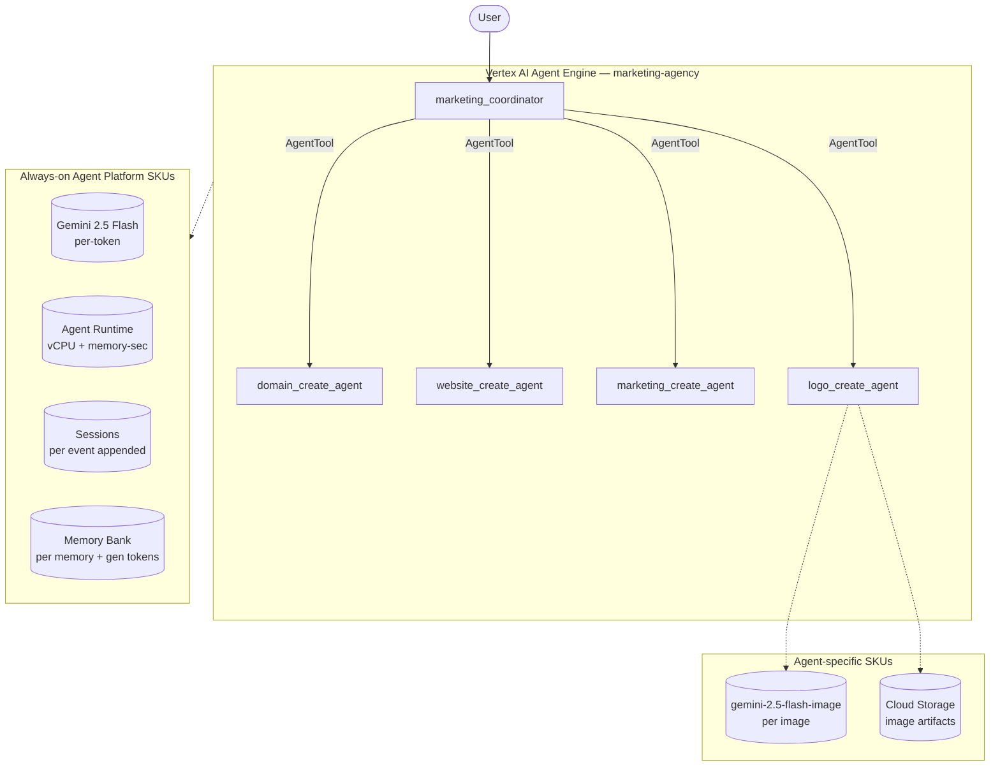

# SKU Usage Summary — `marketing-agency` (marketing_agency)

- **Source:** google/adk-samples · **Model:** gemini-2.5-flash · **Engine:** `5911509423330689024`
- **Use case:** End-to-end website/branding launch suite · **Complexity:** Medium-High
- **Unit:** 1 interaction = a 2-turn conversation in a single session, followed by a memory-write step (3.7 model calls on average). All numbers below are averaged over **80 interactions**. Deployed on Vertex AI Agent Engine.
- **Focus:** measured **usage per SKU**; dollar cost is a secondary derived view (§6).

## 1. Architecture

`marketing_coordinator` (root) delegates to 4 specialist creators wrapped as AgentTools:
- `domain_create_agent` — suggests/validates domain names
- `website_create_agent` — drafts website hero + content
- `marketing_create_agent` — develops the marketing plan
- `logo_create_agent` — generates the brand logo via Imagen (gemini-2.5-flash-image)

Logo generation is the only sub-agent that exercises the genmedia SKU surface.

**Pattern:** Hierarchical (coordinator + AgentTool creators)

## 2. SKUs (products) consumed

Gemini tokens; Agent Runtime (vCPU + memory); Sessions; Memory Bank; Imagen / gemini-2.5-flash-image (genmedia, billed per image); Google Search grounding (capable, not triggered in our 2-turn workloads).

(Sessions and Agent Runtime are billed automatically by Agent Engine; Memory Bank generation is triggered by `add_session_to_memory`. Where the agent uses Google Search grounding or image generation, that usage is reported in §5.)

## 3. How usage was measured

Each interaction = a 2-turn conversation in one session, followed by `add_session_to_memory` (which triggers Memory Bank generation). We ran **80 interactions** to capture run-to-run variability, waited 300s for Cloud Monitoring metrics to settle, then read usage: token counts come from Cloud Monitoring **`token_count`** — the **complete** total. This agent delegates to sub-agents invoked as callable tools (ADK `AgentTool`), and those sub-agent model calls do not appear in the parent agent's response stream, so a stream-based count undercounts this agent by **1.2283×**; `token_count` captures every model call and corrects it; runtime (vCPU / memory-seconds) and Memory Bank usage come from Cloud Monitoring (per-engine metrics).

## 4. SKU usage per interaction (PRIMARY)

Measured usage quantities per interaction (averaged over 80 interactions), with the min–max range and variability label across interactions.

| SKU dimension | Unit | Typical | Range | Variability |
|---|---|---|---|---|
| Gemini input tokens | tokens | 10304 | 3843–27818 | High |
| Gemini output tokens (incl. thinking) | tokens | 4046 | 1828–10681 | High |
| Gemini tokens — coordinator agent (input) | tokens | 9889 | — | — |
| Gemini tokens — coordinator agent (output) | tokens | 3399 | — | — |
| Gemini tokens — sub-agents (input) | tokens | 415 | — | — |
| Gemini tokens — sub-agents (output) | tokens | 647 | — | — |
| Model calls | calls | 3.7 | — | Medium |
| Agent Runtime — vCPU | vCPU-seconds | 187.9 | — | — |
| Agent Runtime — memory | GiB-seconds | 231.3 | — | — |
| Sessions | events appended | 7.6 | — | Medium |
| Memory Bank — generation | tokens | 2762 | — | — |
| Memory Bank — memories written | memories | 0.6 | — | — |
| Memory Bank — retrievals | reads | 0.4 | — | — |
| Firestore — document writes | writes | 0.05 | — | — |
| Firestore — document reads | reads | 1.01 | — | — |
| Vertex AI Search (RAG) — queries | searches | 1.70 | — | — |
| Google Search grounding | grounded query-turns | 0.53 | — | — |

_**Coordinator vs sub-agent token split** — the share of total Gemini tokens processed by the root coordinator agent versus the sub-agents it delegates to. Measured directly by running the coordinator and the sub-agents on two different model versions (coordinator on gemini-3.5-flash, sub-agents on gemini-3.1-flash-lite) and separating their token counts by model in Cloud Monitoring — this is the **master/sub** split in the two-model measurement. The input-vs-output breakdown within each role is allocated by the measured per-role input:output ratio (coordinator ≈ 88:12, sub-agents ≈ 61:39). Single-agent agents have no sub-agents, so they are 100% coordinator._

## 5. Grounding & media usage

- **Google Search grounding:** 0.53 grounded query-turns per interaction. Grounding runs inside a dedicated web-research sub-agent that the coordinator invokes as a tool (ADK `AgentTool`); each call issues one or more native `google_search` requests and returns grounded results. We count each web-research call as one grounded query-turn — the billable unit (~$14 / 1K grounded query-turns). Native `google_search` grounding is encapsulated inside the AgentTool and is not tracked by Cloud Monitoring's `web_search_requests` metric, so the AgentTool call count is the reliable measure.
- **Image generation (Imagen):** none in this workload. (Would bill ~$0.04 / image if used.)

## 5b. Caveats on usage capture

- **Agent Runtime (vCPU / GiB-seconds)** is the engine's allocated compute amortized over the measurement window, so it depends on utilization (queries per hour). Treat it as an upper bound, not actual billed instance-time.
- **Memory storage** (the number of stored memories accruing over time) is not captured here — it is only available from the billing export.
- **Grounding** is counted from the agent's tool calls (Cloud Monitoring's grounding metric is project-wide, with no per-engine label); **Imagen** image counts come from response events.
- **Not yet captured:** Cloud Trace, Cloud Logging, Cloud Storage.

## 6. Secondary: derived cost (usage × catalog list price)

Provided for reference only. List price, not actual billed; **usage above is the primary output.**

| SKU | $/interaction |
|---|---|
| Gemini tokens | 0.0132 |
| Agent Runtime | 0.0062 |
| Memory Bank + Sessions | 0.0030 |
| Firestore (4 writes / 81 reads over 80 interactions) | 0.0000001 |
| Vertex AI Search (RAG: 1.70 queries/interaction @ $1.50/1K) | 0.002550 |
| Google Search grounding (0.53 grounded query-turns/interaction @ $14/1K) | 0.007350 |
| Memory Bank retrieval (0.40 memories retrieved/interaction @ $0.5/1K) | 0.000200 |
| Model Armor (derived: 14350 tok scanned @ $0.10/1M) | 0.001435 |
| **Total (measured SKUs)** | **0.0339** (range 0.0149–0.0442) |

## 7. Test workload & sample interactions

Each interaction used a fresh user id. The workload draws from **1 distinct conversation scenarios** of varying length (2–16 turns); real-world conversations differ in length and topic, so cycling several scenarios spreads coverage rather than repeating a single script. Longer interactions repeat these same base scenarios to exercise multi-turn cost scaling.

**Scenario 1** (2 turns):

| Turn | User query |
|---|---|
| 1 | Create a brand concept for a new oat-milk startup called OatJoy. |
| 2 | Suggest a tagline and a simple landing-page hero section. |

**Sample interaction (first run):**

- **Turn 1** (3703 in / 667 out tokens) — user: *Create a brand concept for a new oat-milk startup called OatJoy.*
  - reply preview: Welcome to establishing OatJoy's powerful online presence! I'm here to guide you through defining your digital identity.  First, let's talk about choosing the perfect domain name for OatJoy. To help m…
- **Turn 2** (1863 in / 282 out tokens) — user: *Suggest a tagline and a simple landing-page hero section.*
  - reply preview: That's a great idea, and we'll definitely get to crafting a compelling tagline and a captivating landing page hero section for OatJoy! Those elements are crucial for engaging your audience.  However, …

Full transcripts: `data/transcript_marketing_agency.jsonl` (one JSON record per turn; full input, output_text, every tool call+response, per-step usage). **Not committed** (data/ is gitignored — runtime artifact).