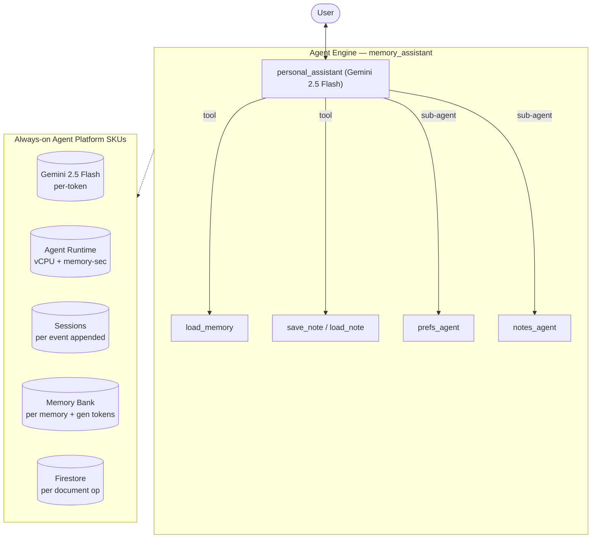

# SKU Usage Summary — `memory_assistant` (memory_assistant)

- **Source:** google/adk-samples · **Model:** gemini-2.5-flash · **Engine:** `6626790115710599168`
- **Use case:** Personal assistant with cross-session memory · **Complexity:** High: Hierarchical + Memory Bank
- **Unit:** 1 interaction = a 2-turn conversation in a single session, followed by a memory-write step (5.5 model calls on average). All numbers below are averaged over **80 interactions**. Deployed on Vertex AI Agent Engine.
- **Focus:** measured **usage per SKU**; dollar cost is a secondary derived view (§6).

## 1. Architecture

Personal assistant with long-term cross-session memory (coordinator + 2 specialist sub-agents via transfer: prefs_agent for unit preferences, notes_agent for checklists). Recalls the user every turn with `load_memory` and persists details with Firestore `save_note`/`load_note`. Memory-Bank-driven: its defining cost is memory generation + retrieval, not conversation tokens. Sub-agents run via `transfer_to_agent`, so their tokens appear in the stream (no AgentTool undercount).

**Pattern:** Coordinator + 2 sub-agents (transfer) + Memory Bank + Firestore

## 2. SKUs (products) consumed

Gemini tokens; Agent Runtime (vCPU + memory); Sessions; **Memory Bank** (generation + retrieval — the defining SKU); **Firestore** (save_note/load_note). No RAG / Search grounding / Imagen.

(Sessions and Agent Runtime are billed automatically by Agent Engine; Memory Bank generation is triggered by `add_session_to_memory`. Where the agent uses Google Search grounding or image generation, that usage is reported in §5.)

## 3. How usage was measured

Each interaction = a 2-turn conversation in one session, followed by `add_session_to_memory` (which triggers Memory Bank generation). We ran **80 interactions** to capture run-to-run variability, waited 300s for Cloud Monitoring metrics to settle, then read usage: token counts come from the model's per-response `usage_metadata` (exact — this agent makes no AgentTool-hidden sub-agent calls, so the response stream already sees every model call); runtime (vCPU / memory-seconds) and Memory Bank usage come from Cloud Monitoring (per-engine metrics).

## 4. SKU usage per interaction (PRIMARY)

Measured usage quantities per interaction (averaged over 80 interactions), with the min–max range and variability label across interactions.

| SKU dimension | Unit | Typical | Range | Variability |
|---|---|---|---|---|
| Gemini input tokens | tokens | 6294 | 2089–21600 | High |
| Gemini output tokens (incl. thinking) | tokens | 2336 | 308–7357 | High |
| Gemini tokens — coordinator agent (input) | tokens | 4803 | — | — |
| Gemini tokens — coordinator agent (output) | tokens | 970 | — | — |
| Gemini tokens — sub-agents (input) | tokens | 1490 | — | — |
| Gemini tokens — sub-agents (output) | tokens | 1366 | — | — |
| Model calls | calls | 5.5 | — | Medium |
| Agent Runtime — vCPU | vCPU-seconds | 160.3 | — | — |
| Agent Runtime — memory | GiB-seconds | 192.2 | — | — |
| Sessions | events appended | 11.3 | — | Medium |
| Memory Bank — generation | tokens | 2472 | — | — |
| Memory Bank — memories written | memories | 1.3 | — | — |
| Memory Bank — retrievals | reads | 0.9 | — | — |
| Firestore — document writes | writes | 2.26 | — | — |
| Firestore — document reads | reads | 0.31 | — | — |

_**Coordinator vs sub-agent token split** — the share of total Gemini tokens processed by the root coordinator agent versus the sub-agents it delegates to. Measured directly by running the coordinator and the sub-agents on two different model versions (coordinator on gemini-3.5-flash, sub-agents on gemini-3.1-flash-lite) and separating their token counts by model in Cloud Monitoring — this is the **master/sub** split in the two-model measurement. The input-vs-output breakdown within each role is allocated by the measured per-role input:output ratio (coordinator ≈ 88:12, sub-agents ≈ 61:39). Single-agent agents have no sub-agents, so they are 100% coordinator._

## 5. Grounding & media usage

- **Google Search grounding:** none in this workload — the agent does not call `google_search`. (Would bill ~$14 / 1K grounded query-turns if used.)
- **Image generation (Imagen):** none in this workload. (Would bill ~$0.04 / image if used.)

## 5b. Caveats on usage capture

- **Agent Runtime (vCPU / GiB-seconds)** is the engine's allocated compute amortized over the measurement window, so it depends on utilization (queries per hour). Treat it as an upper bound, not actual billed instance-time.
- **Memory storage** (the number of stored memories accruing over time) is not captured here — it is only available from the billing export.
- **Grounding** is counted from the agent's tool calls (Cloud Monitoring's grounding metric is project-wide, with no per-engine label); **Imagen** image counts come from response events.
- **Not yet captured:** Cloud Trace, Cloud Logging, Cloud Storage.

## 6. Secondary: derived cost (usage × catalog list price)

Provided for reference only. List price, not actual billed; **usage above is the primary output.**

| SKU | $/interaction |
|---|---|
| Gemini tokens | 0.0077 |
| Agent Runtime | 0.0000 |
| Memory Bank + Sessions | 0.0007 |
| Firestore (181 writes / 25 reads over 80 interactions) | 0.0000006 |
| Memory Bank retrieval (0.89 memories retrieved/interaction @ $0.5/1K) | 0.000444 |
| Model Armor (derived: 8630 tok scanned @ $0.10/1M) | 0.000863 |
| **Total (measured SKUs)** | **0.0097** (range 0.0022–0.0256) |

## 7. Test workload & sample interactions

Each interaction repeated the same 2-turn workload shown below, to isolate run-to-run variability; each used a fresh user id.

**Workload (turn-by-turn):**

| Turn | User query |
|---|---|
| 1 | Hi, I'm Sam. I prefer metric units and I'm vegetarian — please remember that. |
| 2 | What's 70F in my preferred units, and suggest a quick dinner idea for me. |
| 3 | Hi, I'm Sam. I prefer metric units and I'm vegetarian — please remember that. |
| 4 | What's 70F in my preferred units, and suggest a quick dinner idea for me. |
| 5 | Hi, I'm Sam. I prefer metric units and I'm vegetarian — please remember that. |
| 6 | What's 70F in my preferred units, and suggest a quick dinner idea for me. |
| 7 | Hi, I'm Sam. I prefer metric units and I'm vegetarian — please remember that. |
| 8 | What's 70F in my preferred units, and suggest a quick dinner idea for me. |
| 9 | Hi, I'm Sam. I prefer metric units and I'm vegetarian — please remember that. |
| 10 | What's 70F in my preferred units, and suggest a quick dinner idea for me. |
| 11 | Hi, I'm Sam. I prefer metric units and I'm vegetarian — please remember that. |
| 12 | What's 70F in my preferred units, and suggest a quick dinner idea for me. |
| 13 | Hi, I'm Sam. I prefer metric units and I'm vegetarian — please remember that. |
| 14 | What's 70F in my preferred units, and suggest a quick dinner idea for me. |
| 15 | Hi, I'm Sam. I prefer metric units and I'm vegetarian — please remember that. |
| 16 | What's 70F in my preferred units, and suggest a quick dinner idea for me. |
| 17 | Hi, I'm Sam. I prefer metric units and I'm vegetarian — please remember that. |
| 18 | What's 70F in my preferred units, and suggest a quick dinner idea for me. |
| 19 | Hi, I'm Sam. I prefer metric units and I'm vegetarian — please remember that. |
| 20 | What's 70F in my preferred units, and suggest a quick dinner idea for me. |
| 21 | Hi, I'm Sam. I prefer metric units and I'm vegetarian — please remember that. |
| 22 | What's 70F in my preferred units, and suggest a quick dinner idea for me. |
| 23 | Hi, I'm Sam. I prefer metric units and I'm vegetarian — please remember that. |
| 24 | What's 70F in my preferred units, and suggest a quick dinner idea for me. |
| 25 | Hi, I'm Sam. I prefer metric units and I'm vegetarian — please remember that. |
| 26 | What's 70F in my preferred units, and suggest a quick dinner idea for me. |
| 27 | Hi, I'm Sam. I prefer metric units and I'm vegetarian — please remember that. |
| 28 | What's 70F in my preferred units, and suggest a quick dinner idea for me. |
| 29 | Hi, I'm Sam. I prefer metric units and I'm vegetarian — please remember that. |
| 30 | What's 70F in my preferred units, and suggest a quick dinner idea for me. |
| 31 | Hi, I'm Sam. I prefer metric units and I'm vegetarian — please remember that. |
| 32 | What's 70F in my preferred units, and suggest a quick dinner idea for me. |

**Sample interaction (first run):**

- **Turn 1** (1428 in / 173 out tokens) — user: *Hi, I'm Sam. I prefer metric units and I'm vegetarian — please remember that.*
  - reply preview: Got it, Sam! I'll remember that you prefer metric units and are vegetarian.
- **Turn 2** (3993 in / 1665 out tokens) — user: *What's 70F in my preferred units, and suggest a quick dinner idea for me.*
  - reply preview: 70°F is approximately 21.1°C.  70°F is approximately 21.1°C.  For a quick vegetarian dinner, how about a 15-minute black bean quesadilla? Just sauté some black beans with your favorite spices (like cu…
- **Turn 3** (1810 in / 559 out tokens) — user: *Hi, I'm Sam. I prefer metric units and I'm vegetarian — please remember that.*
  - reply preview: Thanks, Sam! I've made a note that you prefer metric units and are vegetarian. I'll remember that for our future conversations.
- **Turn 4** (3862 in / 1249 out tokens) — user: *What's 70F in my preferred units, and suggest a quick dinner idea for me.*
  - reply preview: 70°F is 21.1°C.  Thanks for the temperature conversion! 70°F is 21.1°C.  For a quick vegetarian dinner, how about some black bean tacos with avocado and salsa? They're easy to make and delicious!
- **Turn 5** (1435 in / 239 out tokens) — user: *Hi, I'm Sam. I prefer metric units and I'm vegetarian — please remember that.*
  - reply preview: It's great to meet you, Sam! I've made a note that you prefer metric units and are vegetarian. I'll remember that for our future conversations. How can I help you today?
- **Turn 6** (935 in / 263 out tokens) — user: *What's 70F in my preferred units, and suggest a quick dinner idea for me.*
  - reply preview: 
- **Turn 7** (1417 in / 174 out tokens) — user: *Hi, I'm Sam. I prefer metric units and I'm vegetarian — please remember that.*
  - reply preview: Hello Sam! I've made a note that you prefer metric units and are vegetarian. It's great to meet you! How can I help you today?
- **Turn 8** (20183 in / 7183 out tokens) — user: *What's 70F in my preferred units, and suggest a quick dinner idea for me.*
  - reply preview: For a quick vegetarian dinner, how about a lentil soup or a tofu and vegetable stir-fry? Both are easy to make and you can customize them with your favorite spices and vegetables.  Now, regarding the …
- **Turn 9** (1451 in / 212 out tokens) — user: *Hi, I'm Sam. I prefer metric units and I'm vegetarian — please remember that.*
  - reply preview: Hello Sam! I've noted that you prefer metric units and are vegetarian. I'll remember that. It's a pleasure to meet you!
- **Turn 10** (5131 in / 4143 out tokens) — user: *What's 70F in my preferred units, and suggest a quick dinner idea for me.*
  - reply preview: Hi Sam!  I'm back. For a quick vegetarian dinner, how about some black bean tacos with avocado and salsa? They're fast, flavorful, and filling!  Regarding the 70°F conversion to metric, I can't perfor…
- **Turn 11** (5876 in / 2098 out tokens) — user: *Hi, I'm Sam. I prefer metric units and I'm vegetarian — please remember that.*
  - reply preview: Thanks, Sam! I've made a note that you prefer metric units and are vegetarian. I'll remember that for our future conversations.
- **Turn 12** (9247 in / 1612 out tokens) — user: *What's 70F in my preferred units, and suggest a quick dinner idea for me.*
  - reply preview: 21.11 degrees Celsius.  You got it. 70F is 21.11 degrees Celsius.  For a quick vegetarian dinner, how about a 15-minute lentil soup, or a quick veggie stir-fry with some noodles or rice?
- **Turn 13** (1490 in / 200 out tokens) — user: *Hi, I'm Sam. I prefer metric units and I'm vegetarian — please remember that.*
  - reply preview: Hello Sam! I've noted that you prefer metric units and are vegetarian. I'll keep that in mind.
- **Turn 14** (7312 in / 2498 out tokens) — user: *What's 70F in my preferred units, and suggest a quick dinner idea for me.*
  - reply preview: 70°F is 21.11°C.  Great! For a quick vegetarian dinner, how about some black bean tacos? You just need tortillas, a can of black beans (rinsed and drained), some salsa, and any other toppings you like…
- **Turn 15** (1609 in / 361 out tokens) — user: *Hi, I'm Sam. I prefer metric units and I'm vegetarian — please remember that.*
  - reply preview: Hello Sam! I've made a note that you prefer metric units and are vegetarian. I'll remember that for our future conversations.
- **Turn 16** (6205 in / 2230 out tokens) — user: *What's 70F in my preferred units, and suggest a quick dinner idea for me.*
  - reply preview: 70°F is approximately 21.1°C. I can help you with unit conversions, but I can't suggest dinner ideas. I'll transfer you to Sam's personal assistant for that.  Thanks for waiting! Since you're vegetari…
- **Turn 17** (1414 in / 254 out tokens) — user: *Hi, I'm Sam. I prefer metric units and I'm vegetarian — please remember that.*
  - reply preview: Hello Sam! It's great to meet you. I've made a note that you prefer metric units and are vegetarian. I'll remember that for our future conversations.  How can I help you today?
- **Turn 18** (2917 in / 1344 out tokens) — user: *What's 70F in my preferred units, and suggest a quick dinner idea for me.*
  - reply preview: 70°F is 21.11°C.  Okay, Sam. Since you're vegetarian, how about a quick stir-fry with tofu and your favorite vegetables, served over rice or noodles? It's fast, customizable, and delicious!
- **Turn 19** (648 in / 139 out tokens) — user: *Hi, I'm Sam. I prefer metric units and I'm vegetarian — please remember that.*
  - reply preview: 
- **Turn 20** (3937 in / 1204 out tokens) — user: *What's 70F in my preferred units, and suggest a quick dinner idea for me.*
  - reply preview: 70°F is 21.11°C. I can help with temperature conversions, but I'm not able to suggest dinner ideas. I'll transfer you to my colleague who can help with that.  That's 21.11°C in your preferred units!  …
- **Turn 21** (4023 in / 1268 out tokens) — user: *Hi, I'm Sam. I prefer metric units and I'm vegetarian — please remember that.*
  - reply preview: Thanks, Sam! I've noted that you prefer metric units and are vegetarian. I'll remember that for our future interactions.
- **Turn 22** (5750 in / 2689 out tokens) — user: *What's 70F in my preferred units, and suggest a quick dinner idea for me.*
  - reply preview: 70°F is approximately 21.1°C.   Okay, 70°F is approximately 21.1°C.  For a quick vegetarian dinner idea, how about some black bean tacos? You can quickly sauté some black beans with a little onion, be…
- **Turn 23** (1452 in / 253 out tokens) — user: *Hi, I'm Sam. I prefer metric units and I'm vegetarian — please remember that.*
  - reply preview: Got it, Sam! I'll remember that you prefer metric units and are vegetarian. Nice to meet you!
- **Turn 24** (3929 in / 1764 out tokens) — user: *What's 70F in my preferred units, and suggest a quick dinner idea for me.*
  - reply preview: 70F is 21.11 degrees Celsius.  Okay, 70F is 21.11 degrees Celsius.  For a quick vegetarian dinner, how about a hearty lentil soup or some black bean burgers? Both are quick to make and delicious!
- **Turn 25** (648 in / 79 out tokens) — user: *Hi, I'm Sam. I prefer metric units and I'm vegetarian — please remember that.*
  - reply preview: 
- **Turn 26** (5279 in / 2541 out tokens) — user: *What's 70F in my preferred units, and suggest a quick dinner idea for me.*
  - reply preview: 70°F is 21.11°C.  Thanks for waiting! 70°F is 21.11°C.  For a quick vegetarian dinner idea, how about some black bean tacos or a simple pasta primavera? Both are fast and delicious!
- **Turn 27** (1471 in / 225 out tokens) — user: *Hi, I'm Sam. I prefer metric units and I'm vegetarian — please remember that.*
  - reply preview: Thanks, Sam! I've made a note that you prefer metric units and are vegetarian. I'll remember that for future interactions.
- **Turn 28** (3110 in / 1836 out tokens) — user: *What's 70F in my preferred units, and suggest a quick dinner idea for me.*
  - reply preview: 70°F is 21.11°C.  Okay Sam, 70°F is 21.11°C.  As for a quick dinner idea, since you're vegetarian, how about some black bean tacos with avocado and salsa? They're quick, easy, and delicious!
- **Turn 29** (1458 in / 203 out tokens) — user: *Hi, I'm Sam. I prefer metric units and I'm vegetarian — please remember that.*
  - reply preview: It's great to meet you, Sam! I've made a note that you prefer metric units and are vegetarian. I'll remember these details to personalize our future interactions.
- **Turn 30** (4202 in / 3260 out tokens) — user: *What's 70F in my preferred units, and suggest a quick dinner idea for me.*
  - reply preview: Great! I suggest a quick vegetarian stir-fry with tofu and plenty of colorful vegetables like bell peppers, broccoli, and snap peas, served over some rice or noodles. It's fast, customizable, and deli…
- **Turn 31** (1565 in / 306 out tokens) — user: *Hi, I'm Sam. I prefer metric units and I'm vegetarian — please remember that.*
  - reply preview: Hi Sam, I've made a note that you prefer metric units and are vegetarian. I'll remember that for our future conversations!
- **Turn 32** (4831 in / 1710 out tokens) — user: *What's 70F in my preferred units, and suggest a quick dinner idea for me.*
  - reply preview: Okay, since you're vegetarian, how about a quick black bean stir-fry with some rice or quinoa? It's fast, healthy, and easy to customize with your favorite veggies.

Full transcripts: `data/transcript_memory_assistant.jsonl` (one JSON record per turn; full input, output_text, every tool call+response, per-step usage). **Not committed** (data/ is gitignored — runtime artifact).