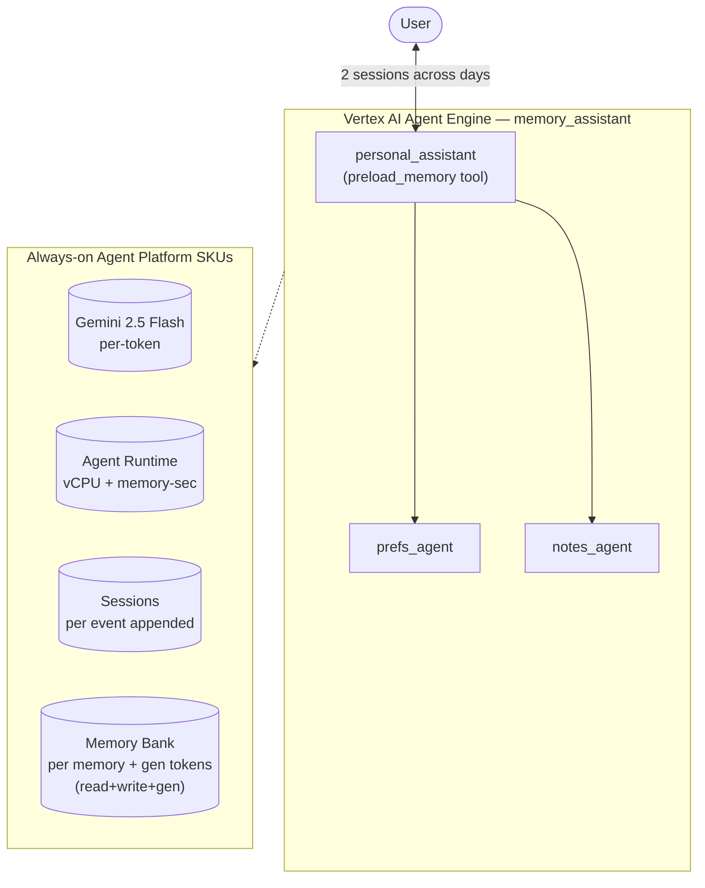

# Agent Cost Summary — `memory_assistant`

> **Template note:** this is the per-agent summary format we produce for every agent. Sections:
> (1) architecture, (2) components/SKUs used, (3) how experiments were run, (4) typical usage +
> cost with variance. Copy this file per agent and fill from its experiment reports.

- **Model:** gemini-2.5-flash
- **Engine:** `reasoningEngines/4783370910813913088` (Vertex AI Agent Engine / GEAP Agent Runtime)
- **Experiments:** EXP-004 (full priced breakdown), EXP-005 (4-run variability) — see PROJECT_RUNBOOK.md
- **Status:** most complex agent deployed (sub-agents + Memory Bank)

---

## 1. Architecture

A coordinator with long-term memory that delegates to two specialist sub-agents.

```
personal_assistant (coordinator, gemini-2.5-flash)
├── tool: preload_memory            ← recalls user facts from Memory Bank each turn
├── sub_agent: prefs_agent          → set_unit_preference, convert_temp
└── sub_agent: notes_agent          → make_checklist

Memory Bank (auto-wired on Agent Engine deploy, ADK >=1.5.0)
  - add_session_to_memory → server-side LLM extracts memories
  - preload_memory        → retrieves memories into context
Sessions (managed, persistent) → every turn/event persisted
```



**Cost unit — "1 interaction" = 3 user messages across 2 sessions** (NOT a single query):
1. Session A, turn 1 — give facts (name/job)
2. Session A, turn 2 — give preferences (units/diet)
3. `add_session_to_memory` — server-side memory generation
4. Session B, turn 1 — recall question

Those 3 turns fan out to ~5.75 model calls and ~9 Agent Runtime requests. All "per interaction"
numbers below cover this whole flow — so they are **not comparable** to a single-query agent's
$/query (e.g. weather/research, EXP-001/002). Normalize to $/turn or $/model-call to compare.

---

## 2. Components / SKUs used

| GCP component | SKU / meter | Capture source |
|---------------|-------------|----------------|
| Gemini 2.5 Flash | input/output/cached tokens | `usage_metadata` (per query) |
| Agent Runtime | vCPU-sec + GiB-sec | Cloud Monitoring `reasoning_engine/*/allocation_time` |
| Memory Bank — generate | Gemini tokens (server-side) | Monitoring `memory_bank/generate_memories_token_count` |
| Memory Bank — retrieve | per retrieval op | Monitoring `memory_bank/memory_retrieval_count` |
| Memory Bank — store | per memory/month | export-only (monthly) |
| Sessions | per event appended | observed events (approx; export for authoritative) |
| Cloud Trace / Logging / GCS | spans / GiB / GB-mo | not captured (needs export) |

All prices are catalog list prices pulled live via `pricing.py`.

---

## 3. How the experiments were run

1. **Deploy once** to Agent Engine (`scripts/deploy.py --agent memory_assistant`); Memory Bank +
   managed Sessions auto-wire.
2. **Drive the workflow** (`scripts/exp004_memory.py`, `scripts/exp005_variability.py`):
   per run = Session A (2 fact turns) → `add_session_to_memory` → 20s wait → Session B (recall).
   Per-run token usage captured instantly from `usage_metadata`.
3. **Settle ~300s** for Cloud Monitoring ingestion (metrics lag ~3–5 min), then pull runtime +
   memory_bank metrics scoped to the engine over the run window (60s alignment, sum-in-window).
4. **Repeat N times** (EXP-005: 4 runs, fresh user each to isolate per-run noise) and compute
   typical (average), range (low–high), and variability for each usage dimension.
5. **Price** every captured quantity × catalog rate; report per-SKU and total per run.

Reproduce: `python scripts/exp005_variability.py --runs 4 --settle 300`.

---

## 4. Typical usage & cost (per interaction)

### Usage distribution (EXP-005, 4 runs, identical workload)

| Metric | Typical (avg) | Range (low–high) | Variability |
|--------|---------------|------------------|-------------|
| input tokens | 3,398 | 2,552–4,001 | Medium |
| output tokens (incl. thinking) | 1,605 | 752–3,150 | **High** |
| model calls | 5.75 | 5–6 | Low |
| session events | 11.5 | 10–12 | Low |
| memory retrievals / run | ~2.5 | — | — |
| memories written / run | ~3.25 | — | — |
| recall success | 100% | — | — |

### Cost per interaction, by SKU (typical, catalog list price)

| SKU | typical / run | notes |
|-----|---------------|-------|
| Conversation tokens | **$0.0050** | range $0.0029–$0.0091 — the main cost swing |
| Memory generation tokens | ~$0.0008 | ~2,500 tok @ input rate |
| Memory retrievals | ~$0.0013 | ~2.5 × $0.0005 |
| Session events | ~$0.0029 | ~11.5 × $0.00025 |
| Agent Runtime (amortized) | ~$0.0035 | **utilization-dependent** — low here (busy window); rises at low QPS |
| **Total per interaction** | **≈ $0.013** | excludes monthly memory storage + Trace/Logging/egress |

### Variance summary

- **Model cost swings ~3.1× run-to-run** for the identical task (high variability), driven almost
  entirely by **output/thinking tokens** — the model "thinks" a variable amount each run.
- **Structural usage is stable** (model calls, session events, input tokens vary little run-to-run).
- **Function is reliable** (100% recall), so the variability is in *cost*, not correctness.
- **Runtime cost is utilization-dependent**, not a fixed per-run number: idle memory allocation
  dominates at low QPS (see EXP-001), so always state a queries/hour assumption.

**Bottom line:** budget **~$0.013 per interaction at list price**, but treat it as a distribution
(±50% on the model-token portion). For an SLA/quote, use the p50–max range, not the mean, and pin a
utilization assumption for the runtime component.

---

## 5. Caveats & not-yet-captured
- Catalog **list price**, not the project's actual billed rate (internal project; true $ needs BigQuery export).
- **Memory storage** (monthly) and **session-event** authoritative counts are export-only.
- **Cloud Trace** (enabled on deploy), **Logging**, **GCS**, **egress** not captured.
- Runtime amortization depends on the measurement window's utilization.

## 6. Test workload & sample interaction

Total user turns across EXP-004 + EXP-005: **15** (1 single full run + 4 variability runs × 3 turns).
Each "interaction" is a **3-turn flow across 2 sessions** + an `add_session_to_memory` call between
sessions. Fresh `user_id` per variability run so memory state doesn't carry across.

**Repeated workload (turn-by-turn):**

| Turn | Session | User query |
|---|---|---|
| 1 | A | Hi! My name is Alice and I'm a marine biologist in Lisbon. |
| 2 | A | Please remember I always prefer metric units and I'm vegetarian. |
| — | — | *(server-side `add_session_to_memory` → Memory Bank generates memories)* |
| 3 | B | Based on what you know about me, suggest what I should pack for a research trip, and note my dietary preference. |

**Sample recall (Turn 3, from EXP-004):**
> *"Given that you are vegetarian, I will keep that in mind. For a research trip, I'd suggest packing comfortable clothes suitable for the climate of your destination, any necessary research materials (laptop, notebooks, pens), toiletries, and …"*

Recall succeeded **100%** of the time across all 5 runs — the agent always correctly remembered "vegetarian" from Session A without needing it re-told. Functional reliability is high; only the *cost* varies (see §4).

Transcripts for memory_assistant predate the `exp_sample.py` transcript-logging flow, so no JSONL
is committed/captured for this agent — the prompts above came from the experiment scripts
(`scripts/exp004_memory.py`, `scripts/exp005_variability.py`).
