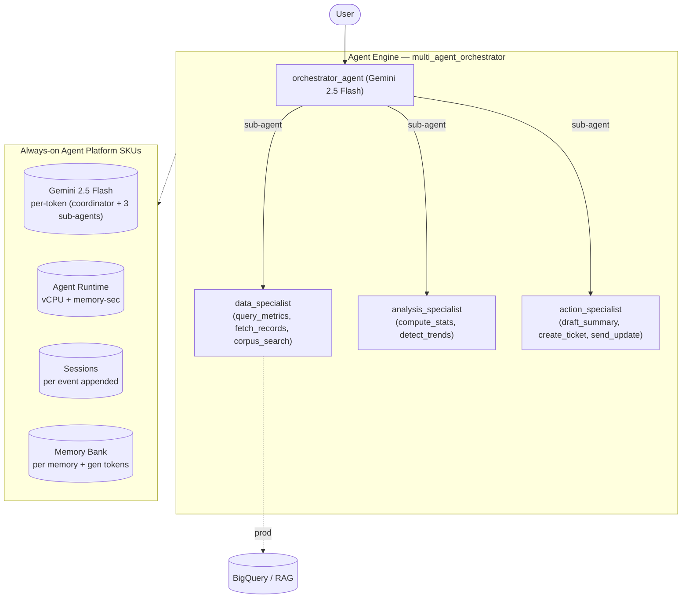

# SKU Usage Summary — `multi-agent-orchestrator (archetype)` (multi_agent_orchestrator)

- **Source:** google/adk-samples · **Model:** gemini-2.5-flash · **Engine:** `6921160164791812096`
- **Use case:** Decompose-and-delegate orchestration · **Complexity:** Archetype: Multi-Agent Orchestrator / Moderate
- **Unit:** 1 interaction = 2-turn conversation + memory-write (13.1 model calls avg). Deployed on Vertex AI Agent Engine (GEAP).
- **Focus:** measured **usage per SKU**; dollar cost is a secondary derived view (§6).

## 1. Architecture

Coordinator that decomposes a request and delegates to 3 specialist sub-agents — data_specialist (metrics / records / corpus), analysis_specialist (stats / trends), action_specialist (summary / ticket / notify) (archetype: Multi-Agent Orchestrator, Moderate). Fan-out-driven and the most expensive of the four: measured ~20,000 input tokens, ~12.5 model calls, ~25 session events per 2-turn interaction (coordinator + sub-agent token multiplication). Specialist tools are local stand-ins for BigQuery / RAG.

**Pattern:** Coordinator + 3 specialist sub-agents (agent-call fan-out)

## 2. SKUs (products) consumed

Gemini tokens (coordinator + sub-agents); Agent Runtime (vCPU + memory); Sessions; Memory Bank. (Specialist BigQuery/RAG calls mocked — would bill in production.)

(Sessions + Agent Runtime are automatic on Agent Engine; Memory Bank generation exercised via add_session_to_memory. Search grounding / Imagen used by the agent but usage not yet metered here — see §7.)

## 3. How usage was measured

Deployed to Agent Engine; per run = 2-turn conversation in one session + add_session_to_memory; **40 runs** for variability; 300s Monitoring settle; token usage from the model response (`usage_metadata`, exact), runtime + Memory Bank usage from Cloud Monitoring (per-engine).
Reproduce: `python scripts/exp_sample.py --package multi_agent_orchestrator --runs 40 --settle 300`

## 4. SKU usage per interaction (PRIMARY)

Measured usage quantities per interaction (avg over 40 runs), with run-to-run range and variability.

| SKU dimension | Unit | Typical | Range | Variability |
|---|---|---|---|---|
| Gemini input tokens | tokens | 22783 | 8224–75848 | High |
| Gemini output tokens (incl. thinking) | tokens | 4320 | 1576–9662 | High |
| Model calls | calls | 13.1 | — | Medium |
| Agent Runtime — vCPU | vCPU-seconds | 180.1 | — | — |
| Agent Runtime — memory | GiB-seconds | 234.3 | — | — |
| Sessions | events appended | 26.2 | — | Medium |
| Memory Bank — generation | tokens | 0 | — | — |
| Memory Bank — memories written | memories | 0.0 | — | — |
| Memory Bank — retrievals | reads | 0.0 | — | — |
| Firestore — document writes | writes | 0.15 | — | — |
| Firestore — document reads | reads | 0.35 | — | — |
| Vertex AI Search (RAG) — queries | searches | 0.45 | — | — |

_Memory retrievals = 0: this agent has no preload_memory tool — it writes memories from the session but doesn't read them back._

## 5. Grounding & media usage (now collected)

- **Google Search grounding:** 0 grounded web-search requests measured (Cloud Monitoring, project-wide). The agent *can* ground on Search but this workload did not trigger it; would bill ~$0.035/request if used.
- **Image generation (Imagen):** 0 images measured (from response events). Would bill ~$0.04/image if used.

## 5b. Caveats on usage capture

- vCPU/GiB-seconds are amortized over the measurement window (utilization-dependent).
- Memory storage (stored-memory count over time) is export-only.
- Grounding count is project-wide (no per-engine label); image count is event-based.
- Still uncaptured: Cloud Trace, Logging, Storage.

## 6. Secondary: derived cost (usage × catalog list price)

Provided for reference only. List price, not actual billed; **usage above is the primary output.**

| SKU | $/interaction |
|---|---|
| Gemini tokens | 0.0176 |
| Agent Runtime | 0.0049 |
| Memory Bank + Sessions | 0.0066 |
| Firestore (6w/14r over 40 runs) | 0.0000001 |
| Vertex AI Search (RAG: 0.45 queries/intxn @ $1.50/1K) | 0.000675 |
| Model Armor (derived: 27103 tok scanned @ $0.10/1M) | 0.002710 |
| **Total (measured SKUs)** | **0.0324** (range 0.0189–0.0584) |

## 7. Test workload & sample interactions

**40 interactions** (144 total user turns), fresh user_id per interaction. Interactions cycle **5 distinct conversation scenarios** of varying length (2-turn×8, 3-turn×8, 4-turn×16, 5-turn×8) — real-world interactions differ in length and topic, so this spreads coverage rather than repeating one script.

**Scenario 1** (2 turns):

| Turn | User query |
|---|---|
| 1 | Analyze last quarter's support-ticket volume trend and recommend actions. |
| 2 | Now draft an executive summary, open a follow-up ticket, and send an update to the ops channel. |

**Scenario 2** (3 turns):

| Turn | User query |
|---|---|
| 1 | Pull our key product metrics for the last 30 days and analyze the trend. |
| 2 | Fetch the related customer records. |
| 3 | Summarize the findings, create a ticket for the biggest issue, and notify the team. |

**Scenario 3** (5 turns):

| Turn | User query |
|---|---|
| 1 | Gather sales metrics and the internal playbook on churn. |
| 2 | Analyze the churn trend. |
| 3 | Cross-reference it with recent support tickets. |
| 4 | Draft an executive summary of what's driving churn. |
| 5 | Open a remediation ticket and send an update to the ops channel. |

**Scenario 4** (4 turns):

| Turn | User query |
|---|---|
| 1 | Look at activation-rate metrics for the last 30 days. |
| 2 | Compare against the prior period and detect the trend. |
| 3 | Check the onboarding playbook for known friction points. |
| 4 | Draft recommendations and open a ticket. |

**Scenario 5** (4 turns):

| Turn | User query |
|---|---|
| 1 | Pull weekly active accounts and ticket volume per 100 accounts. |
| 2 | Analyze whether support load is tracking growth. |
| 3 | Summarize the finding with the key numbers. |
| 4 | Notify the ops channel with the summary. |

**Sample interaction (first run):**

- **Turn 1** (11967 in / 6341 out tokens) — user: *Analyze last quarter's support-ticket volume trend and recommend actions.*
  - reply preview: I am unable to provide a consolidated answer with the findings, analysis, and recommended actions at this time. The data_specialist and analysis_specialist agents did not return specific content for m…
- **Turn 2** (11282 in / 1341 out tokens) — user: *Now draft an executive summary, open a follow-up ticket, and send an update to the ops channel.*
  - reply preview: I have drafted an executive summary, created a follow-up ticket, and sent an update to the ops channel regarding the failure to analyze the support-ticket volume trend.  **Executive Summary:** Executi…

Full transcripts: `data/transcript_multi_agent_orchestrator.jsonl` (one JSON record per turn; full input, output_text, every tool call+response, per-step usage). **Not committed** (data/ is gitignored — runtime artifact).