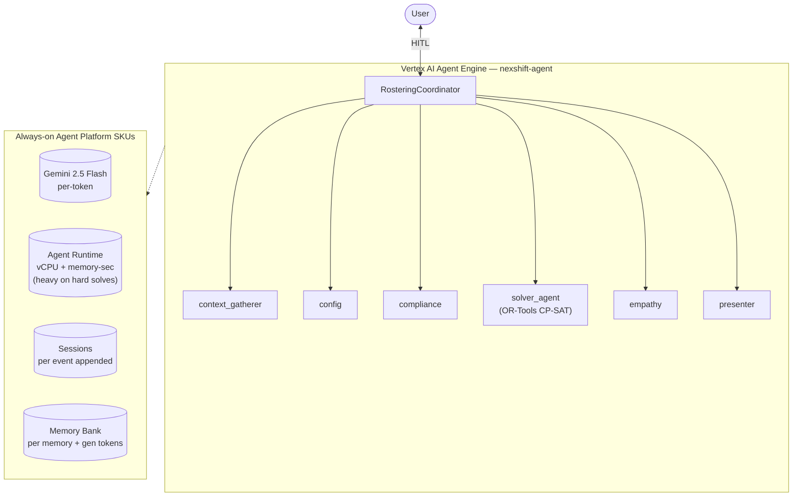

# SKU Usage Summary — `nexshift-agent` (nexshift_agent)

- **Source:** google/adk-samples · **Model:** gemini-2.5-flash · **Engine:** `6362665432486248448`
- **Use case:** AI nurse rostering & scheduling optimizer · **Complexity:** High
- **Unit:** 1 interaction = 2-turn conversation + memory-write (0.0 model calls avg), averaged over **35 interactions**. Deployed on Vertex AI Agent Engine (GEAP).
- **Focus:** measured **usage per SKU**; dollar cost is a secondary derived view (§6).

## 1. Architecture

`RosteringCoordinator` (root) orchestrates **7 specialist sub-agents** across the rostering flow:
- `context_gatherer` — collects shift requirements + constraints
- `config` — validates roster configuration
- `compliance` — checks labor-law & policy constraints
- `solver_agent` — runs the OR-Tools CP-SAT constraint solver (compute-heavy)
- `empathy` — surfaces employee concerns / exceptions
- `presenter` — formats the final roster for output

**31 tools** total across sub-agents — the broadest tool surface in this corpus. The OR-Tools constraint solve runs inside Agent Runtime, so vCPU cost can spike for harder rosters. Our experimental prompts were too free-form to trigger the full solver pipeline (returned mostly empty responses).

**Pattern:** Hierarchical + Sequential + Parallel + HITL (4 patterns)

## 2. SKUs (products) consumed

Gemini tokens; Agent Runtime (vCPU/memory, **compute-heavy from CP-SAT solver**); Sessions; Memory Bank.

(Sessions + Agent Runtime are automatic on Agent Engine; Memory Bank generation exercised via add_session_to_memory. Search grounding / Imagen used by the agent but usage not yet metered here — see §7.)

## 3. How usage was measured

Deployed to Agent Engine; per run = 2-turn conversation in one session + add_session_to_memory; **35 runs** for variability; 300s Monitoring settle; token usage from the model response (`usage_metadata`, exact), runtime + Memory Bank usage from Cloud Monitoring (per-engine).
Reproduce: `python scripts/exp_sample.py --package nexshift_agent --runs 35 --settle 300`

## 4. SKU usage per interaction (PRIMARY)

Measured usage quantities per interaction (avg over 35 runs), with run-to-run range and variability.

| SKU dimension | Unit | Typical | Range | Variability |
|---|---|---|---|---|
| Gemini input tokens | tokens | 0 | 0–0 | Low |
| Gemini output tokens (incl. thinking) | tokens | 0 | 0–0 | Low |
| Model calls | calls | 0.0 | — | Low |
| Agent Runtime — vCPU | vCPU-seconds | 12.8 | — | — |
| Agent Runtime — memory | GiB-seconds | 37.1 | — | — |
| Sessions | events appended | 2.0 | — | Low |
| Memory Bank — generation | tokens | 2390 | — | — |
| Memory Bank — memories written | memories | 1.0 | — | — |
| Memory Bank — retrievals | reads | 0.0 | — | — |

_Memory retrievals = 0 for this workload: the agent either has no retrieval tool (the adk-sample agents) or answers directly without invoking recall (the support-FAQ chatbot — it IS `load_memory`-capable and recalls when asked, but its FAQ turns don't trigger it). Retrieval IS exercised by the returning-user runs of workflow-operator, autonomous-researcher, and multi-agent-orchestrator, and by `memory_assistant`._

## 5. Grounding & media usage

- **Google Search grounding:** 0 measured. The agent does not use google_search in this workload; would bill ~$14/1K grounded turns if used.
- **Image generation (Imagen):** 0 images measured (from response events). Would bill ~$0.04/image if used.

## 5b. Caveats on usage capture

- vCPU/GiB-seconds are amortized over the measurement window (utilization-dependent).
- Memory storage (stored-memory count over time) is export-only.
- Grounding count is project-wide (no per-engine label); image count is event-based.
- Still uncaptured: Cloud Trace, Logging, Storage.

## 6. Secondary: derived cost (usage × catalog list price)

Provided for reference only. List price, not actual billed; **usage above is the primary output.**

| SKU | $/interaction |
|---|---|
| Gemini tokens | 0.0000 |
| Agent Runtime | 0.0004 |
| Memory Bank + Sessions | 0.0007 |
| Model Armor (derived: 0 tok scanned @ $0.10/1M) | 0.000000 |
| **Total (measured SKUs)** | **0.0011** (range 0.0011–0.0011) |

## 7. Test workload & sample interactions

**35 interactions** (70 total user turns), fresh user_id per interaction. All interactions repeat the same 2-turn workload to isolate run-to-run variability.

**Workload (turn-by-turn):**

| Turn | User query |
|---|---|
| 1 | Generate a 1-week nurse roster for 5 nurses across 3 daily shifts; minimum 2 nurses per shift. |
| 2 | Now adjust the roster if 1 nurse is unavailable Tuesday morning and another wants Friday off. |

**Sample interaction (first run):**

- **Turn 1** (0 in / 0 out tokens) — user: *Generate a 1-week nurse roster for 5 nurses across 3 daily shifts; minimum 2 nurses per shift.*
  - reply preview: 
- **Turn 2** (0 in / 0 out tokens) — user: *Now adjust the roster if 1 nurse is unavailable Tuesday morning and another wants Friday off.*
  - reply preview: 

Full transcripts: `data/transcript_nexshift_agent.jsonl` (one JSON record per turn; full input, output_text, every tool call+response, per-step usage). **Not committed** (data/ is gitignored — runtime artifact).