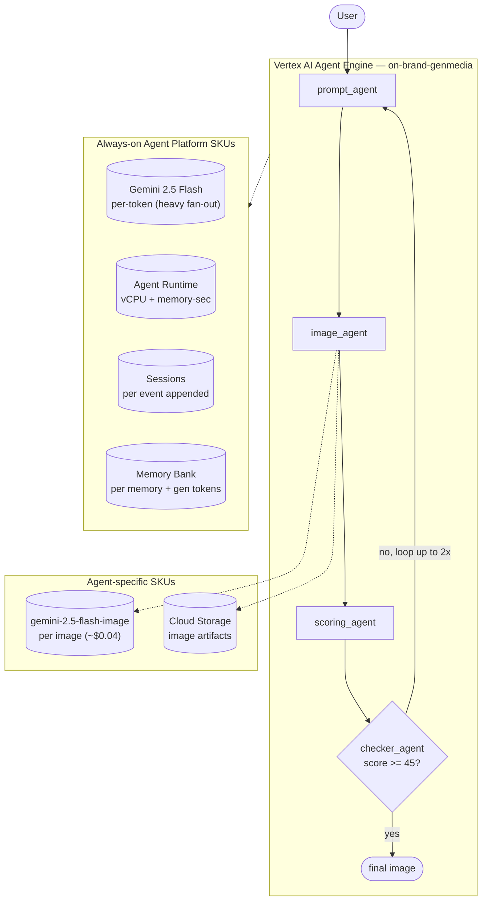

# SKU Usage Summary — `on-brand-genmedia` (on_brand_genmedia)

- **Source:** google/adk-samples · **Model:** gemini-2.5-flash · **Engine:** `4278162910036885504`
- **Use case:** Brand-compliant image generation with quality gate · **Complexity:** High
- **Unit:** 1 interaction = a 2-turn conversation in a single session, followed by a memory-write step (6.9 model calls on average). All numbers below are averaged over **80 interactions**. Deployed on Vertex AI Agent Engine.
- **Focus:** measured **usage per SKU**; dollar cost is a secondary derived view (§6).

## 1. Architecture

Iterative image generation with a scoring gate. Sub-agents:
- `prompt_agent` — refines the image-generation prompt from user intent
- `image_agent` — generates the image via `gemini-2.5-flash-image` (Imagen-family genmedia)
- `scoring_agent` — scores the image against brand guidelines (0–100)
- `checker_agent` — gate: if score < `SCORE_THRESHOLD` (default 45), loop back to prompt refinement; up to `MAX_ITERATIONS` (default 2)

Multiple Imagen calls per interaction make this the costliest agent in our corpus by image-gen SKU + model tokens combined.

**Pattern:** Loop + Hierarchical (iterate-until-on-brand)

## 2. SKUs (products) consumed

Gemini tokens (heavy fan-out across iterations); Agent Runtime (vCPU + memory); Sessions; Memory Bank; **Imagen / gemini-2.5-flash-image** (per-image SKU, multiple per interaction); Cloud Storage (image artifacts).

(Sessions and Agent Runtime are billed automatically by Agent Engine; Memory Bank generation is triggered by `add_session_to_memory`. Where the agent uses Google Search grounding or image generation, that usage is reported in §5.)

## 3. How usage was measured

Each interaction = a 2-turn conversation in one session, followed by `add_session_to_memory` (which triggers Memory Bank generation). We ran **80 interactions** to capture run-to-run variability, waited 300s for Cloud Monitoring metrics to settle, then read usage: token counts come from Cloud Monitoring **`token_count`** — the **complete** total. This agent delegates to sub-agents invoked as callable tools (ADK `AgentTool`), and those sub-agent model calls do not appear in the parent agent's response stream, so a stream-based count undercounts this agent by **4.6347×**; `token_count` captures every model call and corrects it; runtime (vCPU / memory-seconds) and Memory Bank usage come from Cloud Monitoring (per-engine metrics).

## 4. SKU usage per interaction (PRIMARY)

Measured usage quantities per interaction (averaged over 80 interactions), with the min–max range and variability label across interactions.

| SKU dimension | Unit | Typical | Range | Variability |
|---|---|---|---|---|
| Gemini input tokens | tokens | 63013 | 13835–255802 | Very high |
| Gemini output tokens (incl. thinking) | tokens | 9560 | 4361–25255 | Medium |
| Gemini tokens — coordinator agent (input) | tokens | 27424 | — | — |
| Gemini tokens — coordinator agent (output) | tokens | 1387 | — | — |
| Gemini tokens — sub-agents (input) | tokens | 35589 | — | — |
| Gemini tokens — sub-agents (output) | tokens | 8172 | — | — |
| Model calls | calls | 6.9 | — | Medium |
| Agent Runtime — vCPU | vCPU-seconds | 488.8 | — | — |
| Agent Runtime — memory | GiB-seconds | 518.5 | — | — |
| Sessions | events appended | 14.1 | — | Medium |
| Memory Bank — generation | tokens | 2406 | — | — |
| Memory Bank — memories written | memories | 0.6 | — | — |
| Memory Bank — retrievals | reads | 1.2 | — | — |
| Firestore — document writes | writes | 0.68 | — | — |
| Firestore — document reads | reads | 1.31 | — | — |
| Vertex AI Search (RAG) — queries | searches | 1.24 | — | — |

_**Coordinator vs sub-agent token split** — the share of total Gemini tokens processed by the root coordinator agent versus the sub-agents it delegates to. Measured directly by running the coordinator and the sub-agents on two different model versions (coordinator on gemini-3.5-flash, sub-agents on gemini-3.1-flash-lite) and separating their token counts by model in Cloud Monitoring — this is the **master/sub** split in the two-model measurement. The input-vs-output breakdown within each role is allocated by the measured per-role input:output ratio (coordinator ≈ 88:12, sub-agents ≈ 61:39). Single-agent agents have no sub-agents, so they are 100% coordinator._

## 5. Grounding & media usage

- **Google Search grounding:** none in this workload — the agent does not call `google_search`. (Would bill ~$14 / 1K grounded query-turns if used.)
- **Image generation (Imagen):** 0.10 images per interaction. Bills ~$0.04 / image.

## 5b. Caveats on usage capture

- **Agent Runtime (vCPU / GiB-seconds)** is the engine's allocated compute amortized over the measurement window, so it depends on utilization (queries per hour). Treat it as an upper bound, not actual billed instance-time.
- **Memory storage** (the number of stored memories accruing over time) is not captured here — it is only available from the billing export.
- **Grounding** is counted from the agent's tool calls (Cloud Monitoring's grounding metric is project-wide, with no per-engine label); **Imagen** image counts come from response events.
- **Not yet captured:** Cloud Trace, Cloud Logging, Cloud Storage.

## 6. Secondary: derived cost (usage × catalog list price)

Provided for reference only. List price, not actual billed; **usage above is the primary output.**

| SKU | $/interaction |
|---|---|
| Gemini tokens | 0.0428 |
| Agent Runtime | 0.0000 |
| Memory Bank + Sessions | 0.0007 |
| Firestore (54 writes / 105 reads over 80 interactions) | 0.0000002 |
| Vertex AI Search (RAG: 1.24 queries/interaction @ $1.50/1K) | 0.001856 |
| Memory Bank retrieval (1.16 memories retrieved/interaction @ $0.5/1K) | 0.000581 |
| Model Armor (derived: 72573 tok scanned @ $0.10/1M) | 0.007257 |
| Imagen (image generation) | 0.0040 |
| **Total (measured SKUs)** | **0.0572** (range 0.0198–0.1446) |

## 7. Test workload & sample interactions

Each interaction repeated the same 2-turn workload shown below, to isolate run-to-run variability; each used a fresh user id.

**Workload (turn-by-turn):**

| Turn | User query |
|---|---|
| 1 | Generate a brand-aligned hero image for a coffee shop's grand opening promotion. |
| 2 | Now create a variation sized for an Instagram banner. |
| 3 | Generate a brand-aligned hero image for a coffee shop's grand opening promotion. |
| 4 | Now create a variation sized for an Instagram banner. |
| 5 | Generate a brand-aligned hero image for a coffee shop's grand opening promotion. |
| 6 | Now create a variation sized for an Instagram banner. |
| 7 | Generate a brand-aligned hero image for a coffee shop's grand opening promotion. |
| 8 | Now create a variation sized for an Instagram banner. |
| 9 | Generate a brand-aligned hero image for a coffee shop's grand opening promotion. |
| 10 | Now create a variation sized for an Instagram banner. |
| 11 | Generate a brand-aligned hero image for a coffee shop's grand opening promotion. |
| 12 | Now create a variation sized for an Instagram banner. |
| 13 | Generate a brand-aligned hero image for a coffee shop's grand opening promotion. |
| 14 | Now create a variation sized for an Instagram banner. |
| 15 | Generate a brand-aligned hero image for a coffee shop's grand opening promotion. |
| 16 | Now create a variation sized for an Instagram banner. |
| 17 | Generate a brand-aligned hero image for a coffee shop's grand opening promotion. |
| 18 | Now create a variation sized for an Instagram banner. |
| 19 | Generate a brand-aligned hero image for a coffee shop's grand opening promotion. |
| 20 | Now create a variation sized for an Instagram banner. |
| 21 | Generate a brand-aligned hero image for a coffee shop's grand opening promotion. |
| 22 | Now create a variation sized for an Instagram banner. |
| 23 | Generate a brand-aligned hero image for a coffee shop's grand opening promotion. |
| 24 | Now create a variation sized for an Instagram banner. |
| 25 | Generate a brand-aligned hero image for a coffee shop's grand opening promotion. |
| 26 | Now create a variation sized for an Instagram banner. |
| 27 | Generate a brand-aligned hero image for a coffee shop's grand opening promotion. |
| 28 | Now create a variation sized for an Instagram banner. |
| 29 | Generate a brand-aligned hero image for a coffee shop's grand opening promotion. |
| 30 | Now create a variation sized for an Instagram banner. |
| 31 | Generate a brand-aligned hero image for a coffee shop's grand opening promotion. |
| 32 | Now create a variation sized for an Instagram banner. |

**Sample interaction (first run):**

- **Turn 1** (1987 in / 377 out tokens) — user: *Generate a brand-aligned hero image for a coffee shop's grand opening promotion.*
  - reply preview: 
- **Turn 2** (3105 in / 676 out tokens) — user: *Now create a variation sized for an Instagram banner.*
  - reply preview: I'm sorry, I was unable to generate the Instagram banner image. The image generation tool reported an error: "No images generated. No reference images provided".  Would you like me to try again, or pe…
- **Turn 3** (8990 in / 1880 out tokens) — user: *Generate a brand-aligned hero image for a coffee shop's grand opening promotion.*
  - reply preview: I attempted to generate a brand-aligned hero image for your coffee shop's grand opening promotion. However, the image generation tool reported a significant brand mismatch, scoring the generated image…
- **Turn 4** (31230 in / 1844 out tokens) — user: *Now create a variation sized for an Instagram banner.*
  - reply preview: An image for your coffee shop's grand opening Instagram banner (1080x566 pixels) has been generated according to your visual description.  However, similar to the previous attempt, the internal brand …
- **Turn 5** (8836 in / 1660 out tokens) — user: *Generate a brand-aligned hero image for a coffee shop's grand opening promotion.*
  - reply preview: A brand-aligned hero image for the coffee shop's grand opening promotion has been generated, incorporating bright, natural light, a warm and optimistic feel, the brand's deep teal and warm sand color …
- **Turn 6** (17940 in / 588 out tokens) — user: *Now create a variation sized for an Instagram banner.*
  - reply preview: 
- **Turn 7** (3254 in / 750 out tokens) — user: *Generate a brand-aligned hero image for a coffee shop's grand opening promotion.*
  - reply preview: 
- **Turn 8** (9940 in / 616 out tokens) — user: *Now create a variation sized for an Instagram banner.*
  - reply preview: Here is a brand-aligned hero image variation for the coffee shop's grand opening promotion, sized for an Instagram banner (1080x566), consistent with your brand guidelines for colors, style, and conte…
- **Turn 9** (2132 in / 414 out tokens) — user: *Generate a brand-aligned hero image for a coffee shop's grand opening promotion.*
  - reply preview: 
- **Turn 10** (6683 in / 642 out tokens) — user: *Now create a variation sized for an Instagram banner.*
  - reply preview: A brand-aligned hero image for your coffee shop's grand opening promotion, sized for an Instagram banner (1080x566), has been generated. It adheres to your brand guidelines for photography style, colo…
- **Turn 11** (5729 in / 1289 out tokens) — user: *Generate a brand-aligned hero image for a coffee shop's grand opening promotion.*
  - reply preview: I was unable to generate the brand-aligned hero image for the coffee shop's grand opening promotion. The image generation process failed, and therefore no image was produced or evaluated.
- **Turn 12** (11302 in / 642 out tokens) — user: *Now create a variation sized for an Instagram banner.*
  - reply preview: 
- **Turn 13** (1624 in / 935 out tokens) — user: *Generate a brand-aligned hero image for a coffee shop's grand opening promotion.*
  - reply preview: 
- **Turn 14** (6612 in / 860 out tokens) — user: *Now create a variation sized for an Instagram banner.*
  - reply preview: A variation of the brand-aligned hero image for the coffee shop's grand opening promotion, sized for an Instagram banner (1080x566), has been generated. It focuses on a different composition, such as …
- **Turn 15** (3372 in / 745 out tokens) — user: *Generate a brand-aligned hero image for a coffee shop's grand opening promotion.*
  - reply preview: 
- **Turn 16** (4360 in / 1289 out tokens) — user: *Now create a variation sized for an Instagram banner.*
  - reply preview: 
- **Turn 17** (3481 in / 1125 out tokens) — user: *Generate a brand-aligned hero image for a coffee shop's grand opening promotion.*
  - reply preview: 
- **Turn 18** (8641 in / 783 out tokens) — user: *Now create a variation sized for an Instagram banner.*
  - reply preview: I was unable to generate the brand-aligned hero image for the coffee shop's grand opening promotion sized for an Instagram banner. The image generation tool indicated that no image was provided for ev…
- **Turn 19** (483 in / 175 out tokens) — user: *Generate a brand-aligned hero image for a coffee shop's grand opening promotion.*
  - reply preview: 
- **Turn 20** (9839 in / 1658 out tokens) — user: *Now create a variation sized for an Instagram banner.*
  - reply preview: The brand-aligned hero image for your coffee shop's grand opening promotion, sized for an Instagram banner (1080x566), was generated with a brand alignment score of 45/65.  The image successfully inco…
- **Turn 21** (3630 in / 1076 out tokens) — user: *Generate a brand-aligned hero image for a coffee shop's grand opening promotion.*
  - reply preview: 
- **Turn 22** (8307 in / 665 out tokens) — user: *Now create a variation sized for an Instagram banner.*
  - reply preview: The brand-aligned hero image for the coffee shop's grand opening promotion, sized for an Instagram banner (1080x566), has been successfully generated. It incorporates natural light, a candid style, an…
- **Turn 23** (6910 in / 1822 out tokens) — user: *Generate a brand-aligned hero image for a coffee shop's grand opening promotion.*
  - reply preview: 
- **Turn 24** (3651 in / 540 out tokens) — user: *Now create a variation sized for an Instagram banner.*
  - reply preview: I attempted to generate the hero image for your coffee shop's grand opening. However, the image generation tool evaluated the output against "NeuroVibe AI" brand guidelines instead of your coffee shop…
- **Turn 25** (7390 in / 1259 out tokens) — user: *Generate a brand-aligned hero image for a coffee shop's grand opening promotion.*
  - reply preview: A brand-aligned hero image has been generated for the coffee shop's grand opening promotion. It adheres to the Instagram banner size (1080x566), features natural light, a candid style, and negative sp…
- **Turn 26** (4892 in / 950 out tokens) — user: *Now create a variation sized for an Instagram banner.*
  - reply preview: 
- **Turn 27** (7988 in / 1512 out tokens) — user: *Generate a brand-aligned hero image for a coffee shop's grand opening promotion.*
  - reply preview: A brand-aligned hero image for the coffee shop's grand opening promotion has been generated, incorporating natural light, a candid style, and people in a real coffee shop environment, conveying warmth…
- **Turn 28** (19784 in / 1091 out tokens) — user: *Now create a variation sized for an Instagram banner.*
  - reply preview: The generation of a variation sized for an Instagram banner was attempted but was not successful.
- **Turn 29** (7203 in / 1765 out tokens) — user: *Generate a brand-aligned hero image for a coffee shop's grand opening promotion.*
  - reply preview: A brand-aligned hero image for the coffee shop's grand opening promotion has been generated, incorporating natural light, candid style, negative space, and safe zones for text and logo, adhering to th…
- **Turn 30** (9892 in / 703 out tokens) — user: *Now create a variation sized for an Instagram banner.*
  - reply preview: The attempt to generate an Instagram banner variation (1080x566) of the hero image was not successful. No image was generated.
- **Turn 31** (4076 in / 1961 out tokens) — user: *Generate a brand-aligned hero image for a coffee shop's grand opening promotion.*
  - reply preview: 
- **Turn 32** (10573 in / 1010 out tokens) — user: *Now create a variation sized for an Instagram banner.*
  - reply preview: I've generated a brand-aligned hero image for your coffee shop's grand opening promotion, sized for an Instagram banner (1080x566). It features natural light, a candid style, and a warm, optimistic fe…

Full transcripts: `data/transcript_on_brand_genmedia.jsonl` (one JSON record per turn; full input, output_text, every tool call+response, per-step usage). **Not committed** (data/ is gitignored — runtime artifact).