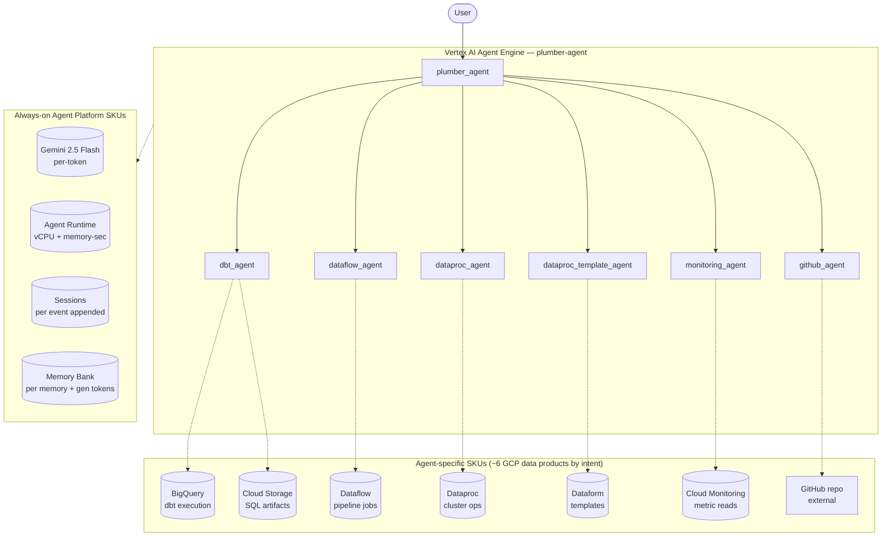

# SKU Usage Summary — `plumber-data-engineering-assistant` (plumber_agent)

- **Source:** google/adk-samples · **Model:** gemini-2.5-flash · **Engine:** `7166518383553282048`
- **Use case:** Build/deploy data pipelines (Dataflow / Dataproc / dbt / GCS) · **Complexity:** High
- **Unit:** 1 interaction = 2-turn conversation + memory-write (6.5 model calls avg), averaged over **79 interactions**. Deployed on Vertex AI Agent Engine (GEAP).
- **Focus:** measured **usage per SKU**; dollar cost is a secondary derived view (§6).

## 1. Architecture



`plumber_agent` (root) routes data-engineering requests to **6 specialist sub-agents** — the deepest hierarchy in this corpus. Each sub-agent owns a distinct GCP data product:
- `dataflow_agent` — Dataflow pipeline design + job submission
- `dataproc_agent` — Dataproc cluster operations
- `dataproc_template_agent` — Dataproc template management
- `dbt_agent` — dbt model generation; writes SQL to **GCS** + executes against **BigQuery**
- `github_agent` — repo operations via GitPython (clone, branch, commit)
- `monitoring_agent` — reads Cloud Monitoring metrics for pipeline observability

By **intent**, this agent touches ~10–11 distinct GCP product SKUs (the broadest in our corpus). In practice, whether each SKU bills depends on whether the user prompt invokes that sub-agent against real resources.

**Pattern:** Hierarchical (deepest in corpus: coordinator + 6 specialists)

## 2. SKUs (products) consumed

Gemini tokens; Agent Runtime (vCPU + memory); Sessions; Memory Bank; **BigQuery** (dbt execution); **Cloud Storage** (SQL artifacts, GCS data IO); **Dataflow**, **Dataproc**, **Dataform** (sub-agent intent, only billed when actually invoked); **Cloud Monitoring** API reads.

(Sessions + Agent Runtime are automatic on Agent Engine; Memory Bank generation exercised via add_session_to_memory. Search grounding / Imagen used by the agent but usage not yet metered here — see §7.)

## 3. How usage was measured

Deployed to Agent Engine; per run = 2-turn conversation in one session + add_session_to_memory; **79 runs** for variability; 300s Monitoring settle; token usage from Cloud Monitoring **`token_count`** (the complete total — captures AgentTool sub-agent tokens the stream misses; undercount factor **1.0655×** vs `usage_metadata`), runtime + Memory Bank usage from Cloud Monitoring (per-engine).
Reproduce: `python scripts/exp_sample.py --package plumber_agent --runs 79 --settle 300`

## 4. SKU usage per interaction (PRIMARY)

Measured usage quantities per interaction (avg over 79 runs), with run-to-run range and variability.

| SKU dimension | Unit | Typical | Range | Variability |
|---|---|---|---|---|
| Gemini input tokens | tokens | 31203 | 7667–85274 | Medium |
| Gemini output tokens (incl. thinking) | tokens | 4318 | 1019–11203 | High |
| Gemini tokens — master/coordinator (input) | tokens | 18553 | — | — |
| Gemini tokens — master/coordinator (output) | tokens | 1054 | — | — |
| Gemini tokens — sub-agents/tools (input) | tokens | 12650 | — | — |
| Gemini tokens — sub-agents/tools (output) | tokens | 3263 | — | — |
| Model calls | calls | 6.5 | — | Medium |
| Agent Runtime — vCPU | vCPU-seconds | 339.8 | — | — |
| Agent Runtime — memory | GiB-seconds | 375.6 | — | — |
| Sessions | events appended | 13.1 | — | Medium |
| Memory Bank — generation | tokens | 3147 | — | — |
| Memory Bank — memories written | memories | 1.3 | — | — |
| Memory Bank — retrievals | reads | 1.9 | — | — |
| Firestore — document writes | writes | 0.11 | — | — |
| Firestore — document reads | reads | 0.65 | — | — |
| Vertex AI Search (RAG) — queries | searches | 1.11 | — | — |
| Google Search grounding — query turns | grounded turns | 1.09 | — | — |


_Master vs sub-agent split: each agent's master/sub token share is measured directly (two-model validation — coordinator on gemini-3.5-flash, sub-agents/tools on gemini-3.1-flash-lite, separated via Cloud Monitoring `token_count` by model). The four input/output × master/sub values reconcile both the master/sub totals and the input/output totals (seeded by the measured per-role in:out ratio — master 88:12, sub 61:39). Single-agent agents are 100% master._

## 5. Grounding & media usage

- **Google Search grounding:** 1.09 grounded query-turns per interaction measured (web_researcher AgentTool invocations; each runs ≥1 native google_search generation). Bills ~$14/1K grounded turns. NOTE: native google_search grounding_metadata is encapsulated inside the AgentTool and the Monitoring web_search_requests metric does not track native ADK google_search — so the AgentTool call count is the measurable unit.
- **Image generation (Imagen):** 0 images measured (from response events). Would bill ~$0.04/image if used.

## 5b. Caveats on usage capture

- vCPU/GiB-seconds are amortized over the measurement window (utilization-dependent).
- Memory storage (stored-memory count over time) is export-only.
- Grounding count is project-wide (no per-engine label); image count is event-based.
- Still uncaptured: Cloud Trace, Logging, Storage.

## 6. Secondary: derived cost (usage × catalog list price)

Provided for reference only. List price, not actual billed; **usage above is the primary output.**

| SKU | $/interaction |
|---|---|
| Gemini tokens | 0.0202 |
| Agent Runtime | 0.0000 |
| Memory Bank + Sessions | 0.0009 |
| Firestore (9w/51r over 79 runs) | 0.0000001 |
| Vertex AI Search (RAG: 1.11 queries/intxn @ $1.50/1K) | 0.001671 |
| Google Search grounding (1.09 grounded turns/intxn @ $14/1K) | 0.015241 |
| Memory Bank retrieval (1.89 memories retrieved/intxn @ $0.5/1K) | 0.000943 |
| Model Armor (derived: 35521 tok scanned @ $0.10/1M) | 0.003552 |
| **Total (measured SKUs)** | **0.0425** (range 0.0058–0.0545) |

## 7. Test workload & sample interactions

**5 interactions** (158 total user turns), fresh user_id per interaction. Interactions cycle **2 distinct conversation scenarios** of varying length (30-turn×1, 32-turn×4) — real-world interactions differ in length and topic, so this spreads coverage rather than repeating one script.

**Scenario 1** (32 turns):

| Turn | User query |
|---|---|
| 1 | First recall any prior pipeline work for me, check the internal data-engineering references and current best practices on the web, then design a Dataflow pipeline that reads daily CSV uploads from GCS and writes cleaned rows to BigQuery. |
| 2 | Using the internal references again, what would the dbt model look like to aggregate the daily data into weekly summaries? Then save the design for me. |
| 3 | First recall any prior pipeline work for me, check the internal data-engineering references and current best practices on the web, then design a Dataflow pipeline that reads daily CSV uploads from GCS and writes cleaned rows to BigQuery. |
| 4 | Using the internal references again, what would the dbt model look like to aggregate the daily data into weekly summaries? Then save the design for me. |
| 5 | First recall any prior pipeline work for me, check the internal data-engineering references and current best practices on the web, then design a Dataflow pipeline that reads daily CSV uploads from GCS and writes cleaned rows to BigQuery. |
| 6 | Using the internal references again, what would the dbt model look like to aggregate the daily data into weekly summaries? Then save the design for me. |
| 7 | First recall any prior pipeline work for me, check the internal data-engineering references and current best practices on the web, then design a Dataflow pipeline that reads daily CSV uploads from GCS and writes cleaned rows to BigQuery. |
| 8 | Using the internal references again, what would the dbt model look like to aggregate the daily data into weekly summaries? Then save the design for me. |
| 9 | First recall any prior pipeline work for me, check the internal data-engineering references and current best practices on the web, then design a Dataflow pipeline that reads daily CSV uploads from GCS and writes cleaned rows to BigQuery. |
| 10 | Using the internal references again, what would the dbt model look like to aggregate the daily data into weekly summaries? Then save the design for me. |
| 11 | First recall any prior pipeline work for me, check the internal data-engineering references and current best practices on the web, then design a Dataflow pipeline that reads daily CSV uploads from GCS and writes cleaned rows to BigQuery. |
| 12 | Using the internal references again, what would the dbt model look like to aggregate the daily data into weekly summaries? Then save the design for me. |
| 13 | First recall any prior pipeline work for me, check the internal data-engineering references and current best practices on the web, then design a Dataflow pipeline that reads daily CSV uploads from GCS and writes cleaned rows to BigQuery. |
| 14 | Using the internal references again, what would the dbt model look like to aggregate the daily data into weekly summaries? Then save the design for me. |
| 15 | First recall any prior pipeline work for me, check the internal data-engineering references and current best practices on the web, then design a Dataflow pipeline that reads daily CSV uploads from GCS and writes cleaned rows to BigQuery. |
| 16 | Using the internal references again, what would the dbt model look like to aggregate the daily data into weekly summaries? Then save the design for me. |
| 17 | First recall any prior pipeline work for me, check the internal data-engineering references and current best practices on the web, then design a Dataflow pipeline that reads daily CSV uploads from GCS and writes cleaned rows to BigQuery. |
| 18 | Using the internal references again, what would the dbt model look like to aggregate the daily data into weekly summaries? Then save the design for me. |
| 19 | First recall any prior pipeline work for me, check the internal data-engineering references and current best practices on the web, then design a Dataflow pipeline that reads daily CSV uploads from GCS and writes cleaned rows to BigQuery. |
| 20 | Using the internal references again, what would the dbt model look like to aggregate the daily data into weekly summaries? Then save the design for me. |
| 21 | First recall any prior pipeline work for me, check the internal data-engineering references and current best practices on the web, then design a Dataflow pipeline that reads daily CSV uploads from GCS and writes cleaned rows to BigQuery. |
| 22 | Using the internal references again, what would the dbt model look like to aggregate the daily data into weekly summaries? Then save the design for me. |
| 23 | First recall any prior pipeline work for me, check the internal data-engineering references and current best practices on the web, then design a Dataflow pipeline that reads daily CSV uploads from GCS and writes cleaned rows to BigQuery. |
| 24 | Using the internal references again, what would the dbt model look like to aggregate the daily data into weekly summaries? Then save the design for me. |
| 25 | First recall any prior pipeline work for me, check the internal data-engineering references and current best practices on the web, then design a Dataflow pipeline that reads daily CSV uploads from GCS and writes cleaned rows to BigQuery. |
| 26 | Using the internal references again, what would the dbt model look like to aggregate the daily data into weekly summaries? Then save the design for me. |
| 27 | First recall any prior pipeline work for me, check the internal data-engineering references and current best practices on the web, then design a Dataflow pipeline that reads daily CSV uploads from GCS and writes cleaned rows to BigQuery. |
| 28 | Using the internal references again, what would the dbt model look like to aggregate the daily data into weekly summaries? Then save the design for me. |
| 29 | First recall any prior pipeline work for me, check the internal data-engineering references and current best practices on the web, then design a Dataflow pipeline that reads daily CSV uploads from GCS and writes cleaned rows to BigQuery. |
| 30 | Using the internal references again, what would the dbt model look like to aggregate the daily data into weekly summaries? Then save the design for me. |
| 31 | First recall any prior pipeline work for me, check the internal data-engineering references and current best practices on the web, then design a Dataflow pipeline that reads daily CSV uploads from GCS and writes cleaned rows to BigQuery. |
| 32 | Using the internal references again, what would the dbt model look like to aggregate the daily data into weekly summaries? Then save the design for me. |

**Scenario 2** (30 turns):

| Turn | User query |
|---|---|
| 1 | First recall any prior pipeline work for me, check the internal data-engineering references and current best practices on the web, then design a Dataflow pipeline that reads daily CSV uploads from GCS and writes cleaned rows to BigQuery. |
| 2 | Using the internal references again, what would the dbt model look like to aggregate the daily data into weekly summaries? Then save the design for me. |
| 3 | First recall any prior pipeline work for me, check the internal data-engineering references and current best practices on the web, then design a Dataflow pipeline that reads daily CSV uploads from GCS and writes cleaned rows to BigQuery. |
| 4 | Using the internal references again, what would the dbt model look like to aggregate the daily data into weekly summaries? Then save the design for me. |
| 5 | First recall any prior pipeline work for me, check the internal data-engineering references and current best practices on the web, then design a Dataflow pipeline that reads daily CSV uploads from GCS and writes cleaned rows to BigQuery. |
| 6 | Using the internal references again, what would the dbt model look like to aggregate the daily data into weekly summaries? Then save the design for me. |
| 7 | First recall any prior pipeline work for me, check the internal data-engineering references and current best practices on the web, then design a Dataflow pipeline that reads daily CSV uploads from GCS and writes cleaned rows to BigQuery. |
| 8 | Using the internal references again, what would the dbt model look like to aggregate the daily data into weekly summaries? Then save the design for me. |
| 9 | First recall any prior pipeline work for me, check the internal data-engineering references and current best practices on the web, then design a Dataflow pipeline that reads daily CSV uploads from GCS and writes cleaned rows to BigQuery. |
| 10 | Using the internal references again, what would the dbt model look like to aggregate the daily data into weekly summaries? Then save the design for me. |
| 11 | First recall any prior pipeline work for me, check the internal data-engineering references and current best practices on the web, then design a Dataflow pipeline that reads daily CSV uploads from GCS and writes cleaned rows to BigQuery. |
| 12 | Using the internal references again, what would the dbt model look like to aggregate the daily data into weekly summaries? Then save the design for me. |
| 13 | First recall any prior pipeline work for me, check the internal data-engineering references and current best practices on the web, then design a Dataflow pipeline that reads daily CSV uploads from GCS and writes cleaned rows to BigQuery. |
| 14 | Using the internal references again, what would the dbt model look like to aggregate the daily data into weekly summaries? Then save the design for me. |
| 15 | First recall any prior pipeline work for me, check the internal data-engineering references and current best practices on the web, then design a Dataflow pipeline that reads daily CSV uploads from GCS and writes cleaned rows to BigQuery. |
| 16 | Using the internal references again, what would the dbt model look like to aggregate the daily data into weekly summaries? Then save the design for me. |
| 17 | First recall any prior pipeline work for me, check the internal data-engineering references and current best practices on the web, then design a Dataflow pipeline that reads daily CSV uploads from GCS and writes cleaned rows to BigQuery. |
| 18 | Using the internal references again, what would the dbt model look like to aggregate the daily data into weekly summaries? Then save the design for me. |
| 19 | First recall any prior pipeline work for me, check the internal data-engineering references and current best practices on the web, then design a Dataflow pipeline that reads daily CSV uploads from GCS and writes cleaned rows to BigQuery. |
| 20 | Using the internal references again, what would the dbt model look like to aggregate the daily data into weekly summaries? Then save the design for me. |
| 21 | First recall any prior pipeline work for me, check the internal data-engineering references and current best practices on the web, then design a Dataflow pipeline that reads daily CSV uploads from GCS and writes cleaned rows to BigQuery. |
| 22 | Using the internal references again, what would the dbt model look like to aggregate the daily data into weekly summaries? Then save the design for me. |
| 23 | First recall any prior pipeline work for me, check the internal data-engineering references and current best practices on the web, then design a Dataflow pipeline that reads daily CSV uploads from GCS and writes cleaned rows to BigQuery. |
| 24 | Using the internal references again, what would the dbt model look like to aggregate the daily data into weekly summaries? Then save the design for me. |
| 25 | First recall any prior pipeline work for me, check the internal data-engineering references and current best practices on the web, then design a Dataflow pipeline that reads daily CSV uploads from GCS and writes cleaned rows to BigQuery. |
| 26 | Using the internal references again, what would the dbt model look like to aggregate the daily data into weekly summaries? Then save the design for me. |
| 27 | First recall any prior pipeline work for me, check the internal data-engineering references and current best practices on the web, then design a Dataflow pipeline that reads daily CSV uploads from GCS and writes cleaned rows to BigQuery. |
| 28 | Using the internal references again, what would the dbt model look like to aggregate the daily data into weekly summaries? Then save the design for me. |
| 29 | First recall any prior pipeline work for me, check the internal data-engineering references and current best practices on the web, then design a Dataflow pipeline that reads daily CSV uploads from GCS and writes cleaned rows to BigQuery. |
| 30 | Using the internal references again, what would the dbt model look like to aggregate the daily data into weekly summaries? Then save the design for me. |

**Sample interaction (first run):**

- **Turn 1** (12932 in / 756 out tokens) — user: *First recall any prior pipeline work for me, check the internal data-engineering references and current best practices on the web, then design a Dataflow pipeline that reads daily CSV uploads from GCS and writes cleaned rows to BigQuery.*
  - reply preview: I understand you want to design a Dataflow pipeline that reads daily CSV uploads from GCS and writes cleaned rows to BigQuery. I'm now transferring your request to our data processing specialist to ha…
- **Turn 2** (10030 in / 1061 out tokens) — user: *Using the internal references again, what would the dbt model look like to aggregate the daily data into weekly summaries? Then save the design for me.*
  - reply preview: To design a dbt model for aggregating daily data into weekly summaries, I'll need more information about your data. However, I can provide a general structure for such a model.  A typical dbt model fo…
- **Turn 3** (2667 in / 326 out tokens) — user: *First recall any prior pipeline work for me, check the internal data-engineering references and current best practices on the web, then design a Dataflow pipeline that reads daily CSV uploads from GCS and writes cleaned rows to BigQuery.*
  - reply preview: 
- **Turn 4** (26334 in / 3740 out tokens) — user: *Using the internal references again, what would the dbt model look like to aggregate the daily data into weekly summaries? Then save the design for me.*
  - reply preview: Here's a design for a dbt model to aggregate daily data into weekly summaries, incorporating best practices for layering, incremental processing, and performance, based on our internal references and …
- **Turn 5** (29316 in / 1214 out tokens) — user: *First recall any prior pipeline work for me, check the internal data-engineering references and current best practices on the web, then design a Dataflow pipeline that reads daily CSV uploads from GCS and writes cleaned rows to BigQuery.*
  - reply preview: Understood. I'm accessing our data processing tools to design a Dataflow pipeline for your daily CSV uploads from GCS to BigQuery. I understand you want a Dataflow pipeline to read daily CSV uploads f…
- **Turn 6** (55042 in / 2886 out tokens) — user: *Using the internal references again, what would the dbt model look like to aggregate the daily data into weekly summaries? Then save the design for me.*
  - reply preview: I have retrieved the internal references and best practices for creating a dbt model to aggregate daily data into weekly summaries, and the design has been noted. I'm now handing over to our data tran…
- **Turn 7** (2667 in / 391 out tokens) — user: *First recall any prior pipeline work for me, check the internal data-engineering references and current best practices on the web, then design a Dataflow pipeline that reads daily CSV uploads from GCS and writes cleaned rows to BigQuery.*
  - reply preview: 
- **Turn 8** (4918 in / 242 out tokens) — user: *Using the internal references again, what would the dbt model look like to aggregate the daily data into weekly summaries? Then save the design for me.*
  - reply preview: 
- **Turn 9** (25075 in / 1014 out tokens) — user: *First recall any prior pipeline work for me, check the internal data-engineering references and current best practices on the web, then design a Dataflow pipeline that reads daily CSV uploads from GCS and writes cleaned rows to BigQuery.*
  - reply preview: Understood. I've gathered all the necessary information, including prior work, internal references, and current best practices. I am now transferring your request to our data processing specialist to …
- **Turn 10** (11422 in / 456 out tokens) — user: *Using the internal references again, what would the dbt model look like to aggregate the daily data into weekly summaries? Then save the design for me.*
  - reply preview: To generate the dbt model SQL for aggregating daily data into weekly summaries, I need a source-to-target transformation mapping. Could you please provide a GCS URL to a CSV file or an image snapshot …
- **Turn 11** (20551 in / 873 out tokens) — user: *First recall any prior pipeline work for me, check the internal data-engineering references and current best practices on the web, then design a Dataflow pipeline that reads daily CSV uploads from GCS and writes cleaned rows to BigQuery.*
  - reply preview: Understood. I've gathered information on your past pipeline work, reviewed our internal data-engineering resources, and researched current best practices for Dataflow. Now, I'm transferring your reque…
- **Turn 12** (10590 in / 2458 out tokens) — user: *Using the internal references again, what would the dbt model look like to aggregate the daily data into weekly summaries? Then save the design for me.*
  - reply preview: Here's a design for a dbt model that aggregates daily data into weekly summaries, incorporating best practices:  **dbt Model Design: Weekly Summaries**  **Model Name:** `weekly_summary` (e.g., `models…
- **Turn 13** (21743 in / 984 out tokens) — user: *First recall any prior pipeline work for me, check the internal data-engineering references and current best practices on the web, then design a Dataflow pipeline that reads daily CSV uploads from GCS and writes cleaned rows to BigQuery.*
  - reply preview: Understood. I'm accessing our data processing tools to design a Dataflow pipeline that reads daily CSV uploads from GCS and writes cleaned rows to BigQuery, incorporating best practices. I can help yo…
- **Turn 14** (23765 in / 3048 out tokens) — user: *Using the internal references again, what would the dbt model look like to aggregate the daily data into weekly summaries? Then save the design for me.*
  - reply preview: It seems there was a transfer loop with the dbt agent. My apologies for the confusion.  To aggregate daily data into weekly summaries, a dbt model would typically look something like this. This exampl…
- **Turn 15** (21025 in / 932 out tokens) — user: *First recall any prior pipeline work for me, check the internal data-engineering references and current best practices on the web, then design a Dataflow pipeline that reads daily CSV uploads from GCS and writes cleaned rows to BigQuery.*
  - reply preview: Understood. I have reviewed your past pipeline work, checked our internal data-engineering references, and researched the latest best practices for Dataflow pipelines. I'm now accessing our data proce…
- **Turn 16** (10637 in / 1478 out tokens) — user: *Using the internal references again, what would the dbt model look like to aggregate the daily data into weekly summaries? Then save the design for me.*
  - reply preview: Based on your requirements, here's the design for a dbt model named `weekly_summary.sql` that aggregates daily data into weekly summaries. This model assumes a source model named `daily_data` which co…
- **Turn 17** (13890 in / 592 out tokens) — user: *First recall any prior pipeline work for me, check the internal data-engineering references and current best practices on the web, then design a Dataflow pipeline that reads daily CSV uploads from GCS and writes cleaned rows to BigQuery.*
  - reply preview: I'm accessing our data processing tools to design a Dataflow pipeline for your daily CSV uploads from GCS to BigQuery, including data cleaning. I understand you want to create a Dataflow pipeline to r…
- **Turn 18** (10699 in / 1856 out tokens) — user: *Using the internal references again, what would the dbt model look like to aggregate the daily data into weekly summaries? Then save the design for me.*
  - reply preview: Based on the description to aggregate daily data into weekly summaries from the `daily_data` model, here is the dbt model SQL design:  ```sql SELECT     DATE_TRUNC(date_column, WEEK) AS week_start,   …
- **Turn 19** (13578 in / 553 out tokens) — user: *First recall any prior pipeline work for me, check the internal data-engineering references and current best practices on the web, then design a Dataflow pipeline that reads daily CSV uploads from GCS and writes cleaned rows to BigQuery.*
  - reply preview: I will now transfer your request to our data processing specialist to design a Dataflow pipeline for reading CSV uploads from GCS and writing cleaned rows to BigQuery. Okay, I can help you design a Da…
- **Turn 20** (10392 in / 2113 out tokens) — user: *Using the internal references again, what would the dbt model look like to aggregate the daily data into weekly summaries? Then save the design for me.*
  - reply preview: Based on your description, here is what the dbt model for aggregating daily data into weekly summaries would look like:  ```sql -- models/marts/weekly_summary.sql {{ config(materialized='table') }}  S…
- **Turn 21** (13982 in / 782 out tokens) — user: *First recall any prior pipeline work for me, check the internal data-engineering references and current best practices on the web, then design a Dataflow pipeline that reads daily CSV uploads from GCS and writes cleaned rows to BigQuery.*
  - reply preview: Understood. I'm accessing our data processing tools to design a new Dataflow pipeline for your daily CSV uploads from GCS to BigQuery. Okay, I understand you want to create a new Dataflow pipeline tha…
- **Turn 22** (10849 in / 2106 out tokens) — user: *Using the internal references again, what would the dbt model look like to aggregate the daily data into weekly summaries? Then save the design for me.*
  - reply preview: Based on the internal references, here's what the dbt model for aggregating daily data into weekly summaries would look like:  **File:** `models/marts/weekly_summary.sql`  ```sql -- This dbt model agg…
- **Turn 23** (20525 in / 700 out tokens) — user: *First recall any prior pipeline work for me, check the internal data-engineering references and current best practices on the web, then design a Dataflow pipeline that reads daily CSV uploads from GCS and writes cleaned rows to BigQuery.*
  - reply preview: Understood. I'm accessing our data processing tools to design a Dataflow pipeline for you. I can certainly help you design a Dataflow pipeline to read CSV files from GCS, clean the data, and write it …
- **Turn 24** (10640 in / 2070 out tokens) — user: *Using the internal references again, what would the dbt model look like to aggregate the daily data into weekly summaries? Then save the design for me.*
  - reply preview: Based on the internal references for aggregating daily data into weekly summaries, here is the dbt model SQL code:  ```sql -- models/marts/weekly_summary.sql  SELECT     DATE_TRUNC(date_column, WEEK) …
- **Turn 25** (14545 in / 794 out tokens) — user: *First recall any prior pipeline work for me, check the internal data-engineering references and current best practices on the web, then design a Dataflow pipeline that reads daily CSV uploads from GCS and writes cleaned rows to BigQuery.*
  - reply preview: Understood. I've recalled past project details, reviewed our internal data engineering resources, and gathered current best practices for Dataflow pipelines. I'm now accessing our data processing tool…
- **Turn 26** (11168 in / 353 out tokens) — user: *Using the internal references again, what would the dbt model look like to aggregate the daily data into weekly summaries? Then save the design for me.*
  - reply preview: A dbt model to aggregate daily data into weekly summaries would look like this:  ```sql -- models/marts/weekly_summary.sql  SELECT     DATE_TRUNC(date_column, WEEK) AS week_start,     SUM(metric_a) AS…
- **Turn 27** (34265 in / 1725 out tokens) — user: *First recall any prior pipeline work for me, check the internal data-engineering references and current best practices on the web, then design a Dataflow pipeline that reads daily CSV uploads from GCS and writes cleaned rows to BigQuery.*
  - reply preview: Understood. I have reviewed your past pipeline work, gathered internal data-engineering references, and researched current best practices for Dataflow. I'm now transferring your request to our data pr…
- **Turn 28** (12833 in / 919 out tokens) — user: *Using the internal references again, what would the dbt model look like to aggregate the daily data into weekly summaries? Then save the design for me.*
  - reply preview: Here is the dbt model to aggregate daily data into weekly summaries, based on the internal references:  ```sql -- models/marts/weekly_summary.sql SELECT   DATE_TRUNC(date_column, WEEK) AS week_start, …
- **Turn 29** (20239 in / 1080 out tokens) — user: *First recall any prior pipeline work for me, check the internal data-engineering references and current best practices on the web, then design a Dataflow pipeline that reads daily CSV uploads from GCS and writes cleaned rows to BigQuery.*
  - reply preview: I will now proceed with designing a Dataflow pipeline for you. I can help you design a Dataflow pipeline to read daily CSV uploads from GCS and write cleaned rows to BigQuery.  To start, please descri…
- **Turn 30** (11735 in / 717 out tokens) — user: *Using the internal references again, what would the dbt model look like to aggregate the daily data into weekly summaries? Then save the design for me.*
  - reply preview: Based on the information provided, the dbt model to aggregate daily data into weekly summaries would look like this:  ```sql -- models/marts/weekly_summary.sql SELECT     DATE_TRUNC(date_column, WEEK)…
- **Turn 31** (14905 in / 1219 out tokens) — user: *First recall any prior pipeline work for me, check the internal data-engineering references and current best practices on the web, then design a Dataflow pipeline that reads daily CSV uploads from GCS and writes cleaned rows to BigQuery.*
  - reply preview: Understood. I will now proceed with designing a Dataflow pipeline to read your daily CSV uploads from GCS, clean the data, and write the processed rows to BigQuery. I can help you design that Dataflow…
- **Turn 32** (11924 in / 726 out tokens) — user: *Using the internal references again, what would the dbt model look like to aggregate the daily data into weekly summaries? Then save the design for me.*
  - reply preview: The dbt model to aggregate daily data into weekly summaries would look like this:  ```sql -- models/marts/weekly_summary.sql SELECT     DATE_TRUNC(date_column, WEEK) AS week_start,     SUM(metric_a) A…

Full transcripts: `data/transcript_plumber_agent.jsonl` (one JSON record per turn; full input, output_text, every tool call+response, per-step usage). **Not committed** (data/ is gitignored — runtime artifact).