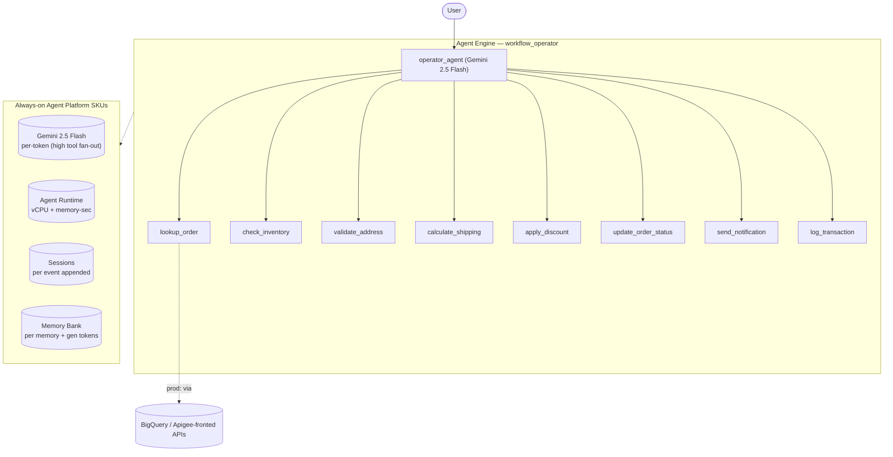

# SKU Usage Summary — `workflow-operator (archetype)` (workflow_operator)

- **Source:** google/adk-samples · **Model:** gemini-2.5-flash · **Engine:** `923632098529509376`
- **Use case:** Order-fulfillment workflow operator · **Complexity:** Archetype: Workflow Operator / Moderate
- **Unit:** 1 interaction = 2-turn conversation + memory-write (12.5 model calls avg). Deployed on Vertex AI Agent Engine (GEAP).
- **Focus:** measured **usage per SKU**; dollar cost is a secondary derived view (§6).

## 1. Architecture

Single agent that drives an order-fulfillment workflow end to end with heavy tool fan-out (archetype: Workflow Operator, Moderate). 8 tools — lookup_order, check_inventory, validate_address, calculate_shipping, apply_discount, update_order_status, send_notification, log_transaction. Tool-fan-out-driven: measured ~12.5 model calls / ~25 session events per 2-turn interaction (highest tool churn of the four archetypes). Tools stand in for backend/API calls (Apigee + BigQuery in prod).

**Pattern:** Single agent + heavy tool fan-out (8 tools)

## 2. SKUs (products) consumed

Gemini tokens; Agent Runtime (vCPU + memory); Sessions; Memory Bank. (Backend tool calls mocked — would bill BigQuery + Apigee in production.)

(Sessions + Agent Runtime are automatic on Agent Engine; Memory Bank generation exercised via add_session_to_memory. Search grounding / Imagen used by the agent but usage not yet metered here — see §7.)

## 3. How usage was measured

Deployed to Agent Engine; per run = 2-turn conversation in one session + add_session_to_memory; **35 runs** for variability; 300s Monitoring settle; token usage from the model response (`usage_metadata`, exact), runtime + Memory Bank usage from Cloud Monitoring (per-engine).
Reproduce: `python scripts/exp_sample.py --package workflow_operator --runs 35 --settle 300`

## 4. SKU usage per interaction (PRIMARY)

Measured usage quantities per interaction (avg over 35 runs), with run-to-run range and variability.

| SKU dimension | Unit | Typical | Range | Variability |
|---|---|---|---|---|
| Gemini input tokens | tokens | 13101 | 7256–32653 | High |
| Gemini output tokens (incl. thinking) | tokens | 1369 | 731–2305 | Medium |
| Model calls | calls | 12.5 | — | Medium |
| Agent Runtime — vCPU | vCPU-seconds | 244.8 | — | — |
| Agent Runtime — memory | GiB-seconds | 302.0 | — | — |
| Sessions | events appended | 25.3 | — | Medium |
| Memory Bank — generation | tokens | 2572 | — | — |
| Memory Bank — memories written | memories | 1.2 | — | — |
| Memory Bank — retrievals | reads | 0.0 | — | — |

_Memory retrievals = 0: this agent has no preload_memory tool — it writes memories from the session but doesn't read them back._

## 5. Grounding & media usage (now collected)

- **Google Search grounding:** 0 grounded web-search requests measured (Cloud Monitoring, project-wide). The agent *can* ground on Search but this workload did not trigger it; would bill ~$0.035/request if used.
- **Image generation (Imagen):** 0 images measured (from response events). Would bill ~$0.04/image if used.

## 5b. Caveats on usage capture

- vCPU/GiB-seconds are amortized over the measurement window (utilization-dependent).
- Memory storage (stored-memory count over time) is export-only.
- Grounding count is project-wide (no per-engine label); image count is event-based.
- Still uncaptured: Cloud Trace, Logging, Storage.

## 6. Secondary: derived cost (usage × catalog list price)

Provided for reference only. List price, not actual billed; **usage above is the primary output.**

| SKU | $/interaction |
|---|---|
| Gemini tokens | 0.0074 |
| Agent Runtime | 0.0066 |
| Memory Bank + Sessions | 0.0010 |
| **Total (measured SKUs)** | **0.0150** (range 0.0118–0.0227) |

## 7. Test workload & sample interaction

Total user turns recorded: **70** (≈ 35 interactions × 2 turns each, fresh user_id per interaction; identical prompts repeat to isolate run-to-run variability).

**Repeated workload (turn-by-turn):**

| Turn | User query |
|---|---|
| 1 | Process order ORD-1001 end to end and apply discount code SAVE10 with express shipping. |
| 2 | Now process order ORD-1003 — flag any issues before shipping. |

**Sample interaction (the first run):**

- **Turn 1** (8112 in / 1045 out tokens) — user: *Process order ORD-1001 end to end and apply discount code SAVE10 with express shipping.*
  - reply preview: Order ORD-1001 for 2 'wireless mouse' units has been successfully processed. Inventory was confirmed, the shipping address was validated, and express shipping was calculated at $16 with a 2-day ETA. A…
- **Turn 2** (1529 in / 228 out tokens) — user: *Now process order ORD-1003 — flag any issues before shipping.*
  - reply preview: 

Full transcripts: `data/transcript_workflow_operator.jsonl` (one JSON record per turn; contains full input, output_text, every tool call+response, and per-step usage). **Not committed** (data/ is gitignored — runtime artifact).